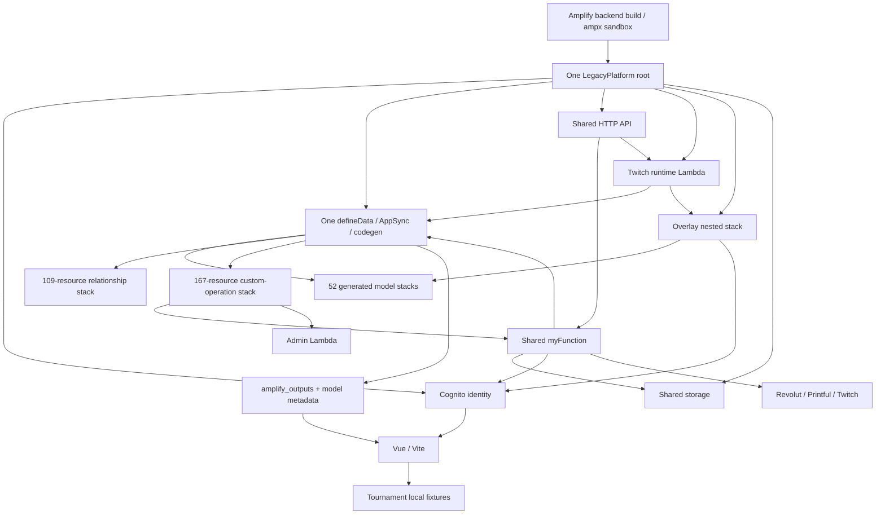
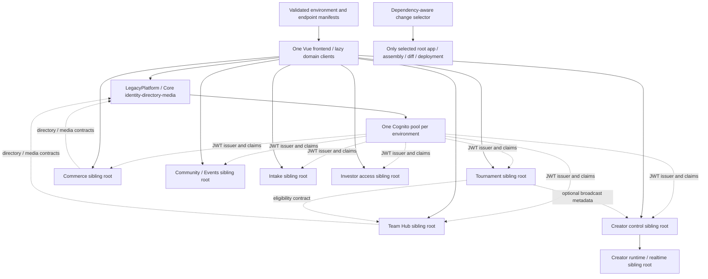

# Project Respawn Phase 2 domain decomposition plan

Date: 26 September 2026. **Analysis and proposal only. Phase 2A is not implemented or authorized for execution by this document.**

## Decision

Preserve the existing Amplify backend as **LegacyPlatform** and introduce independently instantiated **sibling roots**, selected by independent build/deployment commands. Retain one Cognito identity authority per environment. Keep existing stateful resources and API compatibility in LegacyPlatform while domain execution and future products acquire their own ownership boundaries.

Start with a **small, authenticated, stateless Tournament preview deployment proof in Ntgre**. Tournaments currently use frontend fixtures and have no dedicated models or custom operations in the verified Ntgre backend. This proves an independent entrypoint, identity consumption and rollback without transferring a single existing table. Team Hub is a subsequent extraction candidate, not the first physical migration. Its two healthy public operations are a useful compatibility seam, but its implementation still depends on shared runtime, generated data access, authorization data and storage.

Creating more `backend.createStack()` children would not satisfy the objective. Neither would adding sibling roots to one CDK app that instantiates everything, or leaving the existing all-backend CI command unconditional. **Isolation requires changes to entrypoints, source dependencies, configuration composition, build receipts and pipeline selection together.**

## 1. Evidence, chronology and scope

Reviewed the [readiness gate](phase1-ntgre-readiness-2026-09-26.md), [initial AWS change-set gate](phase1-ntgre-change-set-2026-09-26.md), [discrepancy reconciliation](phase1-ntgre-discrepancy-review-2026-09-26.md), [successful execution](phase1-ntgre-execution-2026-09-26.md), and [Team Hub recovery](team-hub-post-phase1-recovery-2026-09-26.md). The execution report supersedes earlier NOT READY/unexecuted snapshots: 308 redundant resources were removed, with zero actual replacements and no protected-resource loss. Recovery then fixed local URL/rendering issues without an AWS deployment.

The original [September audit](../../audit-readonly-2026-09-10/executive-summary.md), its dependency/resource/stack inventories, security, cost, performance, orphan-candidate and proposed-next-phase reports remain historical evidence. That collection actually completed on 12 September, covered 397 current stacks across environments, and included 16,969 heterogeneous resource/subresource/history rows. Those rows are not the current Ntgre CloudFormation count. Its failed historical local targets and production's 475-resource directive stack must not be confused with today's healthy Ntgre baseline. No historical cleanup candidate became deletion-authorized through this plan.

Analysis uses the post-deployment templates and physical-resource snapshots, with fresh read-only AWS equivalence checks, plus current repository source. The source has pre-existing unrelated changes; source capabilities are not automatically claims about deployed production. No new synthesis, build, deployment, change set, provider invocation, data scan or AWS mutation was run for Phase 2. Production was not inspected afresh or changed. Prior application-health evidence is referenced, not falsely represented as new user-flow testing in this planning task.

Deliverables:

- [Complete stack inventory](phase2-stack-inventory.md): all 62 stack names, parents and counts.
- [Resource/domain map](phase2-resource-domain-map.json): all 2,621 resource declarations, logical/physical IDs, types, construct paths, source attribution, models, custom operations, stateful policies and per-stack dependency summaries. The API-key-bearing physical identifier is redacted and hashed.
- [Dependency map](phase2-dependency-map.json): resolved intrinsic/explicit dependencies, source imports/model use, and classified domain-level edges.
- [Read-only analysis script](phase2-analyze.mjs): local reconstruction; `--verify-live` permits only STS and specified CloudFormation reads. Generated documentation excludes API-key values, secrets and Lambda environment values.

Inventory identity: account `058264289478`, region `eu-north-1`, ARN `arn:aws:iam::058264289478:user/RavenTest`, root `amplify-projectrespawnwebsite-Ntgre-sandbox-8bd9d02332`. Exact collection timestamps and checks are embedded in the resource map. This is the complete **Ntgre hierarchy**, not a newly audited account-wide topology. Existing standalone Twitch runtimes, hosting, bootstrap assets, implicit Lambda log groups and external services are discussed separately and excluded from 2,621.

## 2. Current hierarchy and effective resource cost

| Component | Direct resources | Parent / significance |
| --- | ---: | --- |
| Root | 7 | Six nested-stack handles plus metadata |
| Auth | 37 | Root; existing identity and two application functions |
| Data | 86 | Root; shared API, main Lambda, providers/assets and 55 child handles |
| Generated model children | 52 stacks | Data; one custom-managed table per model, typically 38–50 resources per stack |
| FunctionDirectiveStack | **167** | Data; largest template |
| ConnectionStack | 109 | Data; generated model relationships |
| AmplifyTableManager | 9 | Data; shared table lifecycle provider |
| API stack | 49 | Root; shared REST surface and Lambda permissions |
| Function stack | 4 | Root; dedicated Twitch runtime Lambda/role/policy/metadata |
| Overlay source | 43 | Root; HTTP/WebSocket APIs, native tables, KMS and handler |
| Storage | 12 | Root; shared application bucket and lifecycle infrastructure |
| **Recursive total** | **2,621** | **One root + 61 nested stacks; one deployment unit** |

The data subtree alone accounts for **2,469** declarations. Largest physical stack: `amplify-projectrespawnwebsite-Ntgre-sandbox-amplifyDataFunctionDirectiveStackNestedSta-YEHESWWG7XHS`, 167. No current individual Ntgre template exceeds 300, 400 or 450 resources.

The full hierarchy contains **52 `Custom::AmplifyDynamoDBTable` resources and three native DynamoDB tables**, ten Lambda functions (five reviewed application functions plus five providers), one GraphQL API, 557 AppSync resolvers, 1,601 AppSync functions, 55 data sources, three API Gateway APIs and 36 routes. AppSync declarations total **2,216**, about **84.5%** of the hierarchy. Generated model infrastructure, not the number of handwritten Lambdas, dominates resource cost.

FunctionDirectiveStack remains `79 × 2 + 2 × 4 + 1 = 167`: resolver/auth stage per operation, two shared invocation/data-source/role/policy chains, and metadata. Domain attribution below does not assign those shared chains to Investor merely because their retained logical aliases have Investor names.

AWS's limits are 500 resources per template and 2,500 resources involved in one nested-hierarchy operation. A larger existing hierarchy can have smaller valid updates; 2,621 is not proof every update touches 2,621. It remains an unsafe full-create size. [CloudFormation quotas](https://docs.aws.amazon.com/AWSCloudFormation/latest/UserGuide/cloudformation-limits.html).

### Domain distribution

Counts partition the current inventory exactly once. API resources include AppSync generated functions/resolvers/data sources and API Gateway declarations. Lambda permissions, IAM, metadata and nested handles are in Other. Shared Lambdas are counted under their shared owner, not repeated in every consuming domain. Zero dedicated functions does **not** mean a domain has no executable backend.

| Logical domain | Resources | Lambda functions | Tables | API resources | Other | Aggregate flags |
| --- | ---: | ---: | ---: | ---: | ---: | --- |
| Core / shared | 620 | 7 | 9 | 468 | 136 | >300, >400, >450 |
| Creator Platform | 643 | 2 | 16 | 560 | 65 | >300, >400, >450 |
| Team Hub | 192 | 0 | 4 | 176 | 12 | None |
| Commerce | 312 | 0 | 7 | 284 | 21 | >300 |
| Community / Events | 391 | 0 | 9 | 355 | 27 | >300 |
| Admin / Operations attribution | 463 | 1 | 10 | 420 | 32 | >300, >400, >450 |
| Tournaments | 0 | 0 | 0 | 0 | 0 | Frontend fixtures only |
| Website / Content, dedicated | 0 | 0 | 0 | 0 | 0 | Hosting outside this root; shared media/profile resources counted above |
| Notifications / Communications, dedicated | 0 | 0 | 0 | 0 | 0 | No independent notification service established here |
| **Total** | **2,621** | **10** | **55** | **2,263** | **293** | Aggregate flags are not single-template violations |

The resource map is authoritative for the mechanically computed totals. Core includes cross-domain ConnectionStack resources, shared storage/providers/compute and directory/media models. This is deliberately conservative: a generated relationship is not automatically owned by whichever product appears first in its name. It will require explicit owner/contract review during extraction.

## 3. Actual product boundaries

| Boundary | Evidence and responsibility | Recommendation |
| --- | --- | --- |
| Identity | `amplify/auth`, post-confirmation, user management; pool/client/groups/identity pool | Shared Core contract; retain physical ownership in LegacyPlatform |
| Directory / access / media | UserProfile; PermissionDefinition/GroupPermission/PermissionAuditEvent; Brand/BrandAccess/BrandAccessPermission; MediaCollection/MediaItem; application bucket | Shared capabilities, not one universal business-service Lambda; remain legacy initially |
| Creator control | Four workspace models; five Twitch integration/command/token/OAuth/health models; reward event/claim/nonce models; Discord configuration | One logical Creator domain; control/data lifecycle separate from persistent runtime/realtime delivery |
| Creator runtime / overlays | Dedicated runtime Lambda, overlay handler, three native tables, HTTP/WebSocket, KMS; separate ECS runtime source | Independent runtime/release boundary warranted; existing endpoints/keys/state make extraction risky |
| Team Hub | Team, TeamMembership, TeamRosterSlot, PlayerChampionPoolEntry; gateway/index/policy/dynamo/branding; three operational Vue routes | Cohesive domain; roster, champion pools and coach review remain modules inside it |
| Tournaments | `src/features/tournaments/tournament.data.js` explicitly says frontend-only fixtures; registration, teams, matches, draft, bracket, broadcast and results previews | New domain/root, not additional shared-schema models; begin with stateless proof |
| Commerce | Seven merch/fulfillment models; Revolut checkout/webhook; Printful and fulfillment/recovery/reconciliation; `src/composables/useCheckout.js` | One payment/order authority; own webhooks/idempotency; migrate late |
| Community / Events | Three generic event models and six forum/board/activity/permission models | Distinct from tournament competition state. Keep together initially; split only on lifecycle or measured growth |
| Intake / Applications | Seven Application models, public submission, answers, schedules, idempotency/rate limits and admin review | Real process boundary; not an extension of Creator merely because an application has a creator profile |
| Investor access | Three Investor models, approvals, Cognito lookup and private document access | Separate sensitive-access lifecycle from public intake; keep legacy until reviewed |
| Admin / Operations UI | Cross-domain views and tools | Administrative actions belong to their product owner. Do not extract a giant all-permission Admin root |
| Website / Content | Public Vue pages, shared media/profile data, static content; Amplify hosting outside this hierarchy | Frontend release unit; no speculative CMS backend |
| Notifications | No dedicated Ntgre queue/bus/email service established by this inventory | Keep small notification adapters with owning workflows; introduce shared delivery only when actual consumers justify it |

The source uses **Revolut and Printful**, not an evidenced Stripe implementation. Founder programme, deposits and reservations are potential Commerce capabilities; no dedicated current Ntgre models for those examples were found. Training tools likewise do not justify a new infrastructure root simply from a UI label. Historical RavensBot/Companion resources and external consumer ownership remain **UNRESOLVED**, outside this migration's inferred authority.

The original audit recorded a 13-resource `ProjectRespawnTwitchRuntimeStaging` monitoring stack. Current standalone runtime source has additional managed/external ownership options. The audit's number is historical, not a current deployed count or evidence that ECS resources can be adopted safely. `infrastructure/overlay-source/app.ts` is explicitly a synth-only review entrypoint, not evidence of an independently deployed live overlay stack.

## 4. Dependency graph and classifications

Arrows in the current diagram show calls/configuration flow. The JSON edge direction is **consumer depends on target**. Intrinsic references are resolved through parent parameters and nested outputs; `DependsOn` is included. These are configuration/permission edges, not measured runtime traffic.

| Cross-domain dependency | Classification | Required treatment |
| --- | --- | --- |
| Domain → Cognito issuer/client/sub | SHARED PLATFORM DEPENDENCY | Consume stable identity configuration; no pool ownership transfer |
| Team Hub → four Team models and transactions | HARD DEPENDENCY | Preserve table/index/key/transaction semantics and single writer |
| Team Hub → full generated Schema/client/AppSync | REMOVABLE COUPLING | Domain data adapter and explicit repository API; transition may retain legacy data access |
| Team Hub → effective permissions and Cognito lookup | SHARED PLATFORM DEPENDENCY | Core authorization/directory contract; groups alone are not equivalent |
| Team Hub → team-logos bucket prefix | SHARED PLATFORM DEPENDENCY | Prefix-scoped grant or media API; preserve keys/URLs |
| Unrelated handlers → one Lambda artifact/role | ACCIDENTAL COUPLING | Domain-specific packaging, entrypoints, roles and configuration |
| All models → one schema/provider/codegen/outputs | ACCIDENTAL COUPLING | New domain APIs/data ownership; preserve legacy compatibility during transition |
| Overlay → Creator workspace and Core Brand tables | REMOVABLE COUPLING | Owner read contracts or bounded public projection; do not grant reciprocal writes |
| Runtime → signed lease/control API and overlay delivery | HARD DEPENDENCY | Versioned protocol; additive upgrades and independent rollback |
| OAuth vault → KMS/provider callbacks | HARD DEPENDENCY | Keep key identity/decryption and provider application contracts |
| Commerce → payment/fulfillment providers | HARD DEPENDENCY | Signature checks, idempotency, reconciliation and callback compatibility |
| Admin UI → domain admin APIs | SOFT DEPENDENCY | Federated UI; individual API failures must not grant broader access |
| Tournament → Team eligibility API, future | HARD DEPENDENCY | Synchronous eligibility check at registration; no direct roster writes |
| Tournament → public creator stream metadata, future | SOFT DEPENDENCY | Optional display/projection; never depend on OAuth tokens |
| Domain → pure shared contract/auth library | SOFT DEPENDENCY | Version/lock dependency; consumer tests on change, not automatic redeploy |
| Website → generated outputs / current single REST base | HARD / REMOVABLE respectively | Retain valid legacy outputs; add domain-specific validated endpoint manifest |
| Historical bot/Companion/undocumented integrations | UNKNOWN | Establish owner, actual consumers and environment before proposing extraction |

Specific event paths: the Ntgre table-manager Step Functions workflow is infrastructure provisioning, not a shared business event bus. The Ntgre declarations contain no EventBridge rule, SQS queue, SNS topic or Lambda event-source mapping. External Twitch runtime source does have EventBridge scheduled health/task-stopped consumers and CloudWatch alarms; external providers deliver OAuth/webhook/runtime traffic through APIs. Do not invent a deployed platform-wide event backbone.

Cross-stack exports do not explain all coupling. There are **104 generated table name/stream exports** and **zero `Fn::ImportValue` occurrences inside Ntgre templates**. Internal coupling primarily uses nested output/parameter bindings. Fresh `ListImports` checks are recorded per export in the resource map; absence of CloudFormation importers does not imply absence of application clients, literal IDs, table-name configuration or IAM consumers.

The final read-only collection completed at **2026-09-26T13:06:09.541Z**: all 62 templates/identity maps match, root is `UPDATE_COMPLETE`, and all 104 exports have no CloudFormation importers. AWS's explicit no-importers response was treated as absence; throttled reads were retried with serial export collection. No denied/unresolved read remains in this scope. The dependency inventory records **17,824 reference/DependsOn occurrences**, including **6,251 cross-stack occurrences**, with zero unresolved intrinsic targets. These are occurrences, not unique runtime calls. **26 reviewed domain-level edges** include soft, accidental, removable and unknown external coupling that a template parser alone cannot resolve.

## 5. AppSync decision and Team Hub extraction model

All six data-bearing domain groups contribute to the one `amplify/data/resource.ts` schema. The machine-readable map lists every one of the 52 models and 79 custom query/mutation declarations. Model children own generated CRUD/index/auth pipelines; ConnectionStack owns relationship resources; FunctionDirectiveStack owns custom-operation resolver/auth stages and two shared invocation chains. Common generated output metadata is consumed by both browser clients and backend data clients.

Installed Amplify code makes the mechanism explicit: `@aws-amplify/backend/lib/engine/nested_stack_resolver.js` creates `new NestedStack(rootStack, resourceGroupName)`; `@aws-amplify/backend-data/lib/factory.js` rejects multiple `defineData` calls in the same backend. Splitting schema files or calling `createStack()` again does not give independent schema or release ownership. [Amplify custom resources](https://docs.amplify.aws/react-native/build-a-backend/add-aws-services/custom-resources/) and [circular dependencies](https://docs.amplify.aws/vue/build-a-backend/troubleshooting/circular-dependency/) provide supporting context.

| Option | Independence actually achieved | Decision |
| --- | --- | --- |
| More nested stacks/schema modules | Template/code organization only; same root/app/schema | Reject as the decomposition solution |
| Separate Lambda behind stable existing fields | Handler releases can become independent after one reviewed bridge/grant/config change; schema/data still shared | Useful transitional seam, clearly label partial independence |
| Multiple stacks independently modify one GraphQLSchema or the same resolvers | Competing ownership and schema-update races | Reject |
| One schema owner, separately owned resolver fields | Technically possible with explicit ownership, but schema edits still need the schema owner and existing generated resources need transfer | Not the default extraction route |
| Independent AppSync APIs with same Cognito | Independent schemas/resolvers and deployment roots; clients select endpoints | Preferred where GraphQL/subscriptions fit the domain |
| Domain HTTP API with Cognito JWT | Small explicit contract without generated CRUD overhead | Preferred for first stateless proof and request/response domains |
| AppSync Merged API | Independent source APIs plus shared schema composition/merge/auth conflicts | Defer until an actual single-graph requirement justifies it |

[AppSync Merged APIs](https://docs.aws.amazon.com/appsync/latest/devguide/merged-api.html) support independently owned source APIs and build-time composition, but do not automatically migrate this generated schema or remove merge coordination. The recommended **hybrid** keeps the legacy AppSync endpoint stable while new domains own HTTP or GraphQL endpoints. Avoid forcing every product through a replacement central gateway.

### Team Hub: preserve contract, separate execution before data

Today `readTeamHub` and `mutateTeamHub` use the retained `FnSubmitInvestorAccessRequest` anchor to dispatch into `myFunction` → AppSync router → Team Hub gateway → handlers. Both are deployed and healthy. Their two resolvers and two auth functions account for four of Team Hub's 192 attributed declarations; the remaining 188 are four model stacks plus their nested handles. Shared invocation/relationship/provider costs are not included in that 192.

The frontend service already wraps these calls behind `listMyTeams`, `getTeamHub`, pool and coach operations. Keep those exports, action names, argument validation, AWSJSON decoding, pagination, errors and optimistic revision semantics stable. A future domain-specific client can preserve the same GraphQL field contract against a new endpoint; this is an explicit reviewed adapter/configuration change, not fake entries added to `amplify_outputs.json`.

An intermediate dedicated handler could keep the old endpoint through a stable compatibility adapter that forwards only those two operations to a versioned domain Lambda alias. It would preserve resolver identity, restrict invocation to the bridge and expose no caller-controlled identity override. That one-time bridge deployment touches LegacyPlatform and needs its own inspected scope. Afterward domain code releases can be isolated, but any legacy schema/table change still processes the legacy hierarchy. Do not describe that stage as full Team Hub infrastructure independence.

Full independence additionally requires replacing `shared/dataClient.ts`'s full-Schema coupling, owning the Team Hub API/schema and safely resolving table lifecycle ownership. Existing reads/writes go through model methods; three-table roster/membership changes also use direct DynamoDB transactions. Preserve conditional writes, indexes, pagination, conflict mapping and current writer authority. Replace direct reads of PermissionDefinition/GroupPermission with an authorization contract where justified; keep revocation freshness requirements explicit. Do not duplicate membership into eventually consistent JWT groups.

The 52 model tables are custom-provider resources, not native `AWS::DynamoDB::Table` declarations. A source folder move, `fromTableName`, or Retain policy does not transfer ownership. Native resource import/refactoring support must be checked for the exact type and lifecycle, with provider-delete effects and a rehearsal. [CloudFormation resource support](https://docs.aws.amazon.com/AWSCloudFormation/latest/UserGuide/resource-import-supported-resources.html), [stack refactoring](https://docs.aws.amazon.com/AWSCloudFormation/latest/UserGuide/stack-refactoring.html). Until a safe procedure exists, keep those tables and their provider in LegacyPlatform and report the remaining dependency honestly.

## 6. One identity, multiple deployment owners

Retain the current Ntgre pool `eu-north-1_n24iLL7QE`, client `1iq7ovjaf7d16imdvbqgfgvf86` and identity pool. These are observations, not IDs to manually transplant into another environment. Resolve/validate them from the intended environment's existing outputs during a later reviewed setup. The one-account objective means one user identity within each environment; it is not approval to replace Ntgre auth with production auth or to make nonproduction accept production users.

Each domain consumes a non-secret, versioned contract containing account, region, environment, issuer, pool ID, allowed client IDs and compatibility version. Read this at build/deploy time from an approved environment manifest; SSM Standard parameters are an optional later distribution mechanism. Avoid CDK cross-root construct references, automatically generated exports/imports, or deploy-time lookups that instantiate the Core backend. A reference/imported handle is a consumer, not an owner: no pool/client/group/trust-policy mutation from product stacks.

AppSync APIs can authenticate against the existing pool. HTTP APIs validate issuer, audience/client ID and token expiry through a JWT authorizer; sensitive domain operations additionally check token purpose, scopes where applicable and server-side roles/tenant membership. API Gateway's documented `aud`/`client_id` behavior matters; JWT validation alone is not authorization. [JWT authorizers](https://docs.aws.amazon.com/apigateway/latest/developerguide/http-api-jwt-authorizer.html).

Server-to-server clients use narrowly scoped IAM/SigV4 or an explicit service contract. Browser Cognito Identity Pool IAM grants, if used, belong to a separately reviewed Core change; prefer user-pool JWT calls for the initial proof to avoid changing shared roles. Domain execution roles may read only the exact required resources. Common authorization helpers should be pure, versioned libraries, not imports of the shared backend construct or an all-powerful shared Lambda.

## 7. What changes when one domain changes?

| Stage | Team Hub-only change today | Required target |
| --- | --- | --- |
| Source selection | Shared `amplify/backend.ts` and one schema/router graph | Dedicated domain entrypoint and transitive package inputs |
| Synthesis | Full Amplify backend is instantiated; reachable functions/assets and generated schema participate | Only Team Hub app/assembly; no LegacyPlatform/Creator/Commerce constructs or bundling |
| Diff | Root and its nested hierarchy evaluated; actual changed resources may be a subset | Only Team Hub root against its recorded environment/revision |
| Deployment | Amplify root update; changed children and propagated references can be evaluated | Only Team Hub root, role, assets and change set |
| Failure/rollback | Shared root orchestration and shared handler/provider effects | Domain-owned rollout/rollback; old compatible contracts remain available |
| Frontend-only change | `npm run dev` itself only validates and starts Vite | Continue that behavior; no implicit cloud deploy |

Not every unchanged Lambda/table is updated today. The problem is shared **synthesis, comparison, orchestration and potential reference propagation**, demonstrated by Phase 1's 33 extra AWS modifications. Actual resource actions remain an inspected change-set question.

The current `scripts/lib/infrastructure-inputs.mjs` hashes all `amplify`, `infrastructure`, `scripts`, root package/lock files and `amplify.yml`. New domain files under `infrastructure/domains` would currently invalidate the legacy receipt. Moreover, `amplify.yml` unconditionally calls `ampx pipeline-deploy` after `validate:infrastructure-ci`; the validator's unchanged-input shortcut alone does not skip that deployment command. Both must be addressed before claiming hosted CI isolation.

The future selector must use explicit dependency closures: domain source, domain infrastructure, its lockfile/toolchain and consumed contract versions. Legacy inputs still include everything it actually imports; do not blanket-exclude a directory to hide a real dependency or renew debt receipts automatically. Use separate CDK applications and domain dependency locks. `cdk deploy --exclusively` cannot prevent other stacks from being synthesized if the app already instantiated them.

## 8. Target architecture and size envelope

The boxes are **siblings**, not children of a replacement platform root. Logical Core initially remains physically inside LegacyPlatform. Existing standalone runtime deployment units are reused/evolved where appropriate, not cloned into one runtime per feature. No extra shared event bus, notification root, admin root, per-page stack or per-domain user pool is required.

Provisional long-term envelope, conditional on successful stateful migration reviews:

| Independent unit | Planning resource range, recursive | Rationale / growth |
| --- | ---: | --- |
| LegacyPlatform / Core remainder | 500–750 | Current 620 shared attribution plus compatibility/ownership adjustments; preserve identity and shared media/provider lifecycles |
| Team Hub | 210–270 | Current 192 plus own API/function/role/log/config overhead and apportioned relationships; new training modules need measured deltas |
| Creator control / integrations | 550–700 | Most of current 643 remains generated data/control; runtime/realtime state separated by release lifecycle |
| Creator runtime / realtime | 70–150 | Current overlay 43 and runtime 4 plus independently owned grants, monitoring and runtime deployment overhead; external ECS topology must be inventoried before sizing commitment |
| Tournaments | 120–250 first real service; 250–400 growth review envelope | Explicit native data/API contracts, registrations/matches/draft/broadcast modules; Phase 2A proof is only 12–16 |
| Commerce | 340–430 | Current 312 plus API/handler/observability/relationship ownership; payment/provider additions reviewed separately |
| Community / Events | 420–500 | Current 391 plus dedicated execution and relationship overhead; keep module boundaries; later split only on justified lifecycle/growth |
| Intake / Applications | 310–390 | Seven current form/audit/idempotency models plus own API, handler, security and operational costs |
| Investor access | 150–220 | Three current access/audit/request models plus own sensitive-access service; directory identity stays shared |

Expected eventual topology: **about nine backend deployment units**, plus the existing frontend release. Largest planned recursive unit: **roughly 750**, not a 750-resource individual template. These bands are engineering estimates, not synthesized candidates or a promise to move resources. A typical extracted unit adds roughly 10–30 resources for an API/handler/role/logs/alarms/configuration before relationships or custom providers are considered. Counts are not conserved because shared providers/joins can be duplicated or removed. No cost savings or decrease in total resources is assumed.

Units above 300 are flagged for owner review; above 400 require a growth review; above 450 must demonstrate template partitioning and future headroom. Core, Creator control and Community aggregate totals cross 450, but their small domain-owned nested templates can remain below 250. This is acceptable independent-domain nesting, unlike nesting all products under one deployment root. Existing repository guardrails remain stricter than AWS's hard template limit: normal ≤250/template, warnings at 251–350, redesign/review above 350, hard gate 480; recursive new-root normal ≤1,000 and review/block bands as documented in [CloudFormation boundaries](cloudformation-boundaries.md).

Tournaments must not casually copy the legacy 38–50-resource-per-model pattern. Twenty generated models could add roughly 760–1,000 declarations before shared scaffolding. Forecast real tables, indexes, event consumers, routes, resolvers, grants, permissions, logs, alarms and custom providers before accepting each feature. Start drafting, brackets and broadcast as modules; separate a high-rate realtime runtime only if measured lifecycle/security/scale justifies it. No speculative eight-root tournament system.

**Reachable near-term state is different:** after Phase 2A, LegacyPlatform remains exactly 2,621/167 and one new sibling has about 12–16 resources. After stateless handler separation, legacy data/schema dependencies may still remain. The nine-unit envelope is not declared achieved until each owner transfer and pipeline-isolation test passes.

## 9. Migration risk and LegacyPlatform disposition

| Component / proposed action | Risk | Disposition and principal reasons |
| --- | --- | --- |
| Pure contract/config documentation and isolated stateless preview | LOW | EXTRACT EARLY as a new sibling proof; no current customer data or endpoint cutover |
| New Tournament product backend | MEDIUM | EXTRACT EARLY; new state rather than existing migration, but registration/draft authorization and growth need review |
| Team Hub handler/API | HIGH | EXTRACT EARLY after proof; identity forwarding, policy parity, transactions, logo URLs, generated client and Lambda permissions |
| Team Hub physical model ownership | VERY HIGH | EXTRACT LATER; custom table manager, IDs/indexes, retention and rollback must be proven |
| Creator control/token/OAuth data | VERY HIGH | EXTRACT LATER; KMS decrypt identity, token vault, callback URLs, nonce/idempotency and runtime consumers |
| Creator runtime/overlays | HIGH | EXTRACT LATER in stages; native table ownership, WebSocket connections, browser-source URLs, secrets and ECS ownership |
| Commerce / fulfillment | VERY HIGH | EXTRACT LATER, last business cutover; duplicate charges/orders, webhook signature/idempotency, provider callbacks and reconciliation |
| Community / Events | HIGH for data; MEDIUM for read-only façade | KEEP IN LEGACYPLATFORM initially; generated relations and active content cannot simply be re-created |
| Public intake / sensitive applications | HIGH | KEEP initially; rate limits, duplicate-submission guards, private answers and audit records |
| Investor access / documents | VERY HIGH | KEEP initially; access revocation, signed URLs, private bucket content and elevated Cognito operations |
| Cognito pool/client/groups/post-confirmation | VERY HIGH if moved | SHARED CORE, retain physical resources; no pool migration proposed |
| UserProfile / permissions / Brand directory | HIGH | SHARED CORE; explicit contracts before removing relationship/table grants |
| Existing S3 buckets and KMS keys | VERY HIGH if moved | SHARED CORE or current domain owner; preserve names, object keys, encryption/grants and lifecycle |
| Legacy GraphQL API / outputs / table manager | VERY HIGH if removed prematurely | KEEP until all actual clients and custom resource lifecycles are accounted for |
| Shared dispatcher/old compatibility routes | MEDIUM–HIGH | DEPRECATE EVENTUALLY after consumer evidence, rollback window and separate deletion review |
| Historical failed roots/retained/orphan candidates | UNKNOWN | No migration or cleanup action inferred; owner and recovery review still required |

For every actual extraction, require a resource-by-resource change review covering logical IDs, physical ownership, replacements, deletion policies, UpdateReplacePolicy, provider Delete behavior, IAM and Lambda permission changes, API URLs, outputs/client metadata, event sources and rollback. Preserve backups and demonstrate restore, not merely Retain. Original readiness evidence noted disabled table deletion protection, only two Ntgre tables with PITR, and no enabled bucket versioning; this plan neither fixes nor dismisses those recovery gaps. Recheck before any stateful proposal.

Never have two stacks manage the same resolver/table/key. Never use an imported CDK handle as evidence CloudFormation ownership moved. No dual business writers during cutover. Reversal after real data writes requires reconciliation; restoring an old Lambda alone is not a data rollback. Failure of a stateful migration rehearsal is a stop condition, not permission to recreate Ntgre.

## 10. Recommended sequence

1. **Phase 2A: identity/config contract plus stateless Tournament sibling proof.** Establish the independent entrypoint, package/assembly, scoped deployment command and negative isolation tests without moving data or switching frontend behavior.
2. **Make hosted selection safe and build the first real Tournament capability.** Apply dependency-aware pipeline guards before domain changes can reach the unconditional Amplify deployment. Keep registration/match/draft modules inside the Tournament root; add owned state only after feature/size review.
3. **Separate Team Hub execution and API compatibility.** Preserve `readTeamHub`/`mutateTeamHub`; prove caller identity, role/revocation, revision/transaction and generated-client parity. Keep physical tables legacy until a separate migration proof.
4. **Separate Creator runtime/control release paths.** Inventory actual ECS/external ownership; stabilize signed control and overlay delivery contracts; preserve KMS and OAuth URLs. Extract stateless changes first, then explicitly reviewed native/custom state.
5. **Introduce Community, Intake and Investor owner interfaces as needed.** Public content/intake are not one generic Admin domain; retain sensitive data ownership until recovery and custom-provider migration gates pass. Their scheduling follows real change pressure and dependency removal.
6. **Commerce cutover last.** Stabilize Core media/directory and single order writer; rehearse payment/webhook/fulfillment idempotency and reconciliation using provider test modes, never a speculative live migration.
7. **Remove verified legacy ownership/compatibility only after separate approval.** Reduce the legacy hierarchy through proven transfers and confirmed unused paths. Rehearse safe creation of the target topology before claiming legacy create-size debt resolved.

This is not a big-bang rewrite and does not start with the smallest model stack. The first candidate is selected because it has growth pressure, an existing fixture seam, no production data to move, and a clear independence test. Highest-risk elective extraction is Core identity/custom-managed state; among product cutovers, Commerce and Creator encrypted integration state are highest risk. Lowest-risk first step is the new stateless Tournament preview, which is a deployment proof rather than extraction of live state.

## 11. Domain contracts

| Owner | Inputs / dependencies | Published contract | Consistency / security |
| --- | --- | --- | --- |
| Core identity/directory | Existing Cognito and profile/permission stores | Environment identity manifest; canonical subject; exact-account lookup; versioned capability decision | Backend validates issuer/client and tenant context; revocation-sensitive decisions cannot rely on stale public projections |
| Core media | Existing bucket/prefix authority | Authorized upload/download intent; opaque asset ID/URL | Short-lived signed URLs, content verification, bounded prefixes; no general bucket write grants |
| Team Hub | Core identity/permissions/media | Existing read/mutate contract; future minimal team summary and registration-eligibility API | Single membership/roster writer; expected revision/idempotency; no tournament roster-table writes |
| Creator control | Identity, workspace authority, provider secrets | Versioned lease/manifest protocol; command/config API; approved public creator/stream metadata | Secret/token payloads never in public manifests/events; bounded runtime credentials |
| Creator realtime/runtime | Creator control and publication contract | Overlay publication/version and deduplicated delivery protocol | TTL/connection ownership, credential refresh and replay handling; stable browser-source compatibility |
| Tournaments | Identity; Team Hub eligibility; optional stream metadata | Registration/match/bracket/result APIs; public read projection; later domain events only when consumed | Tournament owns competition state; use team references/snapshots, not cross-domain transactions |
| Commerce | Identity, directory/media, payment/fulfillment providers | Product/read APIs; order command/status; signed webhook ingress | Single order authority; amount/currency/server validation; idempotency and reconciliation |
| Community / Events | Identity/profile/permissions | Events/forums/moderation APIs | Moderation belongs to this owner; page composition is not data ownership |
| Intake / Investor | Identity/directory/media | Submission/review/access-decision APIs | Separate public ingress from privileged review; audit access, PII and expiry |

Start with synchronous HTTP/GraphQL where the caller needs an immediate decision. Use EventBridge only for genuine independent notifications/projections such as `TournamentResultPublished.v1` or `OrderFulfilled.v1`; those names are proposals, not existing resources. If introduced, specify owner, schema/version, event ID, tenant, timestamps, idempotent consumer, retries, DLQ and redrive. Use SQS for actual buffering/backpressure; do not make every request an event. Never make asynchronous projections the sole source for sensitive authorization or charge decisions.

Avoid CloudFormation export locks across product roots. A versioned environment/config artifact can carry stable identifiers without a deployment dependency. SSM is useful for distribution, not a license for a product to change another owner's parameters. Parameter reads must be pinned/captured in the deployment manifest so a rollback restores the same inputs.

## 12. Local workflow and frontend configuration

Proposed commands, not implemented:

| Command | Intended behavior |
| --- | --- |
| `npm run dev` | Validate selected environment/contracts, start Vite; no cloud deployment |
| `npm run dev:team-hub` | Local Team Hub development or explicitly selected domain watcher; never starts unrelated roots |
| `npm run dev:creator` / `dev:tournaments` / `dev:commerce` | Equivalent owner-scoped workflow with fail-closed account/region/environment checks |
| `npm run dev:core` | Explicit legacy/Core maintenance workflow; protected sandbox rules continue to apply |
| `npm run dev:environment` | Opt-in orchestration of selected units, dependency order and endpoint composition; never an implicit side effect of Vite startup |
| `domain:plan -- <domain> --env Ntgre` | Unit selection, tests, isolated synthesis, budget/diff report; no automatic execution |

Keep genuine `amplify_outputs.json` for existing LegacyPlatform authentication/data/storage. Add a separate non-secret `domain-endpoints.<env>.json` generated from each domain's deployment output manifest. Each entry contains owner, account, region, environment, stack ARN, endpoint, auth mode, contract version, deployment revision and provenance. Validate that all entries belong to the intended environment and share the expected identity authority. No merging of several unrelated model-introspection objects into one invented Amplify output schema.

Configure authentication once. Domain clients select their own endpoint explicitly, retaining current service exports and route guards. Keep legacy `generateClient()` use for legacy fields during transition; introduce a dedicated client/adapter only for a migrated domain. Do not repeatedly overwrite global `Amplify.configure()` to switch products. The earlier stale global REST URL demonstrates why per-domain endpoint validation matters.

Core changes invalidate compatibility checks, not every developer's cloud environment. Allow fixture/local-adapter modes to start UI work without rebuilding every backend, but mark fixture data clearly. Backend schema changes require the relevant output/contract validator; frontend-only changes should not trigger backend synthesis. The existing dirty workspace is not a deployment candidate for any proposed stage.

## 13. CI/CD and shared change propagation

Each sibling has its own app, package/lockfile, input manifest, build artifact, resource budget, execution role, change set and deployment record. Prefer one provider-appropriate dispatcher over many uncoordinated pipelines. The repository's evidenced hosted backend runner is Amplify; there is no assumption that a GitHub Actions configuration already exists.

Path filtering is necessary but insufficient. Resolve affected units using a checked-in dependency manifest and actual shared imports:

- Team Hub implementation/infrastructure change → Team Hub tests, contract checks, synthesis, budget, diff and approved deployment only.
- Tournament change → Tournament path only; fail if logs/artifacts show legacy schema compilation, unrelated asset bundling or another root's change set.
- Shared contract/library change → compatibility tests for reverse dependents. Deploy only consumers whose pinned artifacts/configuration actually change; additive compatible contracts should not force all owners to deploy at once.
- Core identity/security change → separately reviewed Core plan plus consumer auth compatibility tests; coordinated rollout only where behavior requires it.
- Shared toolchain or lockfile change → explicit affected build set; separate domain locks prevent every feature change becoming a global toolchain release.
- Frontend-only change → UI tests/build/config checks; no infrastructure deploy. Runtime-owner config changes belong to their owning backend pipeline, not an untyped frontend environment override.

Migration from the current hosted runner must guard **both** the legacy accounting/synthesis step and `ampx pipeline-deploy`. The root receipt's all-directory scan needs an explicit dependency-aware successor, with tests proving real legacy inputs cannot be excluded. This is a separately reviewed CI behavior change; do not alter debt pins just because a domain directory was added. Initial Phase 2A uses a local/Ntgre-only runner and dry-run selection tests; hosted production routing stays inactive until independently reviewed. Thus Phase 2A proves cloud-root isolation, not completion of hosted CI migration.

Use per-domain/environment concurrency locks, immutable artifact promotion, rollback-enabled deployment, explicit stateful/replacement inspection and post-deploy checks. A product deploy role must not be able to update LegacyPlatform or production roots. Breaking contracts require expand/contract sequencing and a retained previous client/API version. Publish timing metrics separately for install, tests, synth/bundle, change-set preparation and CloudFormation execution; no current speedup percentage has been measured.

## 14. Cost impact

Splitting resource ownership is primarily a deployment/reliability improvement, not an automatic cost saving. The historical audit recorded **USD 43.5904 for 30 complete days** and **USD 46.3948 for 90 days** ending 12 September; these are account-wide historical totals, not today's Ntgre run rate or a per-domain budget. WAF, hosting, ECS/EC2/VPC and KMS dominated that window more than Lambda/AppSync requests. No new Cost Explorer collection was needed to make this limited planning estimate.

| Cost driver | Expected effect / control |
| --- | --- |
| More CloudFormation roots | No additional CloudFormation charge for ordinary `AWS::*` resource management; underlying services remain billable. Do not infer custom-provider execution is free. [Pricing](https://aws.amazon.com/cloudformation/pricing/) |
| Extra HTTP/GraphQL endpoints | Request-based charges; moving the same request does not inherently multiply it. Compatibility proxy fan-out or duplicate reads can. Published examples use about $1/million HTTP API requests; AppSync lists $4/million query/data modification operations. These are illustrative reference rates, not a Stockholm quote. [API Gateway](https://aws.amazon.com/api-gateway/pricing/), [AppSync](https://aws.amazon.com/appsync/pricing/) |
| More Lambda artifacts/providers | Idle on-demand functions do not imply an always-running compute bill; extra invocations/duration, layers/assets and provider executions do. Avoid provisioned concurrency for the proof. [Lambda pricing](https://aws.amazon.com/lambda/pricing/) |
| Logs/alarms | More groups and domain alarms add cost; set bounded retention and avoid full payload/token logging. Preserve required audit logs. [CloudWatch pricing](https://aws.amazon.com/cloudwatch/pricing/) |
| EventBridge/queues | Added deliveries, retries and retention can add cost; introduce only for justified consumers. [EventBridge pricing](https://aws.amazon.com/eventbridge/pricing/) |
| Configuration | SSM Standard parameters have no additional storage charge; advanced/high-throughput modes have charges. Phase 2A can use an output manifest without SSM resources. [Systems Manager pricing](https://aws.amazon.com/systems-manager/pricing/) |
| Stateful duplication / KMS / networking | Temporary duplicate tables/storage, new keys, NAT, WAF, dedicated caches or extra always-on ECS capacity can dominate. None is required by Phase 2A |

Illustrative Phase 2A workload: 10,000 preview requests/month, 128 MiB Lambda averaging 100 ms, 0.1 GB logs, two standard alarms, no VPC/NAT/cache/provisioned concurrency. That is 125 GB-seconds plus 10,000 Lambda/API requests. At the published HTTP example rate, the API component is about **$0.01**; apply current eu-north-1 Lambda/log/alarm rates before implementation. A **$1–5/month planning allowance** for the small proof is an estimate, not a quote or cap; exclude tax, existing infrastructure, builds, data egress and future real product traffic. Decomposition at unchanged traffic should be broadly similar in runtime cost, with modest observability/config overhead unless duplicate processing is introduced.

## 15. Phase 2A recommendation — proposal only

### Exact scope

Create one independently deployable **Ntgre Tournament preview** root, proposed name `ProjectRespawn-Tournaments-Ntgre`, with one JWT-authenticated `GET /v1/tournaments/preview` endpoint returning explicitly marked, non-sensitive fixture data matching the existing Tournament preview contract. Include a schema/version/build marker so a second release can demonstrate a domain-only code update. This is a product-shaped contract proof, not live registration, match mutation or a replacement local Amplify sandbox.

Consume the existing Ntgre Cognito issuer/client as validated configuration. Do not create or edit a user pool, client, groups, identity-pool roles, AppSync schema, legacy IAM policy, shared S3 bucket, KMS key, DynamoDB table or existing route. The new Lambda has only its own logging permission. It cannot call LegacyPlatform tables/APIs, Cognito admin APIs, Twitch or payments. Existing frontend pages continue using their current fixtures; no application behavior or endpoint cutover is included in this first stage.

### Proposed files/modules, not created by this plan

| Path | Purpose |
| --- | --- |
| `infrastructure/domains/tournaments/app.ts` | Instantiate only Tournament root; fail on any non-Ntgre account/region/environment |
| `infrastructure/domains/tournaments/stack.ts` | Small explicit native resource set and outputs; no imports of `amplify/backend.ts`/`defineData` |
| `infrastructure/domains/tournaments/package.json`, `package-lock.json`, `tsconfig.json` | Isolated, pinned build/toolchain inputs |
| `domains/tournaments/preview/{handler.ts,contract.ts,fixture.json}` | Validated read-only preview response, no real state or generated shared client |
| `contracts/environment-v1.schema.json`, `contracts/tournament-preview-v1.schema.json` | Identity/config and response schemas |
| `config/environments/Ntgre.core.json` | Non-secret approved identity/provenance snapshot, generated/verified from existing outputs rather than guessed |
| `scripts/domains/{select,plan,deploy,compose-config}.mjs` | Explicit Ntgre-only commands, dry-run dependency selection, isolated assembly/diff and output manifest generation |
| `scripts/config/domain-build-inputs.json` | Declared proof dependency closure; initially used by the new runner, not a silent replacement of the legacy debt receipt |
| Domain unit/contract/isolation test files | Prove auth, fixture contract, absence of legacy imports and target restrictions |

Do not change the existing `amplify/**`, Team Hub, frontend routes, generated outputs, `amplify.yml` or shared budget receipt in Phase 2A. Invoke the domain runner explicitly; a later review handles hosted dispatch and any root-package convenience aliases. Work on an isolated candidate so unrelated dirty changes cannot enter the proof. Before implementation, resolve the exact CLI/library versions from the isolated lockfile and adjust the estimated resource set through review, not by adding arbitrary infrastructure.

### Expected CloudFormation plan

| New resources | Count |
| --- | ---: |
| HTTP API, default stage, JWT authorizer, integration, one GET route | 5 |
| Preview Lambda, scoped execution role with inline logging policy, API invoke permission | 3 |
| Explicit Lambda log group and API access log group | 2 |
| Lambda error and API error alarms | 2 |
| CDK metadata if emitted | 0–1 |
| **Planned declarations** | **12–13** |

Allow a **12–16 planning envelope** only for explained synthesis-generated logging/permission declarations; anything outside the reviewed type/ownership scope returns for review. The final exact count must come from the implementation's isolated synthesis and inspected AWS plan. No synthesis was run to claim these estimates as facts. CloudFormation parameters/outputs are not additional resource declarations; reuse existing bootstrap assets, with no bootstrap mutation or custom provider required.

Existing resources moved: **0**. Existing resources modified/deleted/replaced: **0**. Existing Ntgre resources retained: **all 2,621**. Business-state resources created: **0**. New operational state: log groups/metrics only. Sibling proof adds 12–16 to the environment's combined resource inventory but **does not change the legacy hierarchy's 2,621/167 counts**. No production resource or pipeline execution is included.

### Test and execution gates for a separately authorized implementation

1. Confirm STS account, eu-north-1, existing Ntgre root/identity and baseline hashes. Reject production/staging pool IDs, unknown targets or config provenance mismatch. No new local sandbox identifier.
2. Unit-test preview shape, explicit fixture marker, allowed method, input bounds and absence of stateful/provider clients. Verify trusted JWT context, token purpose and claim handling; never accept identity in request JSON.
3. Compile/test domain only. Assert package and synthesis import graphs cannot reach legacy backend/schema or unrelated product entrypoints. Domain source change must select only Tournament; shared-contract change selects compatibility tests, not automatic deployments.
4. Synthesize **only** the proof app; count every template/root resource. Confirm no imports/exports/construct dependency forcing Core deployment, no custom table manager, no generated model/client assets and no secret values in artifacts.
5. Prepare/review the new root's additive change set only after authorization. Its existing-resource modifications/deletions/replacements must be zero. Target permissions must exclude existing roots. Enable rollback explicitly.
6. After a separately authorized deployment, test missing/expired/wrong-issuer/wrong-client JWT rejection and a valid existing Ntgre test-user token. A real valid token must be available at that gate; current browser mocks are not sufficient to claim live authentication proof. Return fixture data only; do not modify user groups or customer records to make a test pass.
7. Perform a second, small domain-only code revision and roll it back to the first artifact. Capture command logs and CloudFormation events proving no LegacyPlatform synthesis/diff/update, no unrelated Lambda asset bundling, and unchanged legacy stack timestamps/identities. The first successful create alone does not prove ongoing isolation.
8. Recheck unchanged legacy counts 2,621/167, protected IDs, Team Hub contracts and `npm run dev`. Record timings, cost/log volume and output manifest. Do not switch real Tournament pages as part of this proof.

### Rollback and success criteria

Rollback the proof root to its previous immutable code/template/config with rollback enabled. No application route or existing data writer changes, so application rollback is unnecessary. If the first create fails, collect events and allow rollback; do not repeatedly redeploy speculative fixes or touch LegacyPlatform. Retain operational logs according to the reviewed retention policy. Deleting the new proof root later is a separate approved teardown decision, never deletion/recreation of Ntgre.

Success requires all gates above, a working same-identity JWT call, two isolated releases plus rollback, zero changes to the 2,621 legacy resources, no production involvement, documented 12–16-resource actual size and an explicit statement that hosted pipeline selection and stateful domain extraction remain later work. This provides evidence of a genuine independent deployment unit without claiming Phase 2 decomposition is already complete.

## 16. Review outcome and open decisions

The plan is ready for Phase 2A review. Business ownership of shared Brand/media/permissions, external runtime ownership, stateful custom-provider transfer support, recovery readiness, later hosted CI integration and detailed future traffic/cost budgets remain implementation-stage gates. None blocks writing this plan; none is silently treated as resolved or authorization to migrate.

Current largest coupling: the single Amplify schema/root plus shared handler and unconditional hosted backend deployment. Current largest template: 167. Existing protected infrastructure remains unchanged. The proposed end-state has smaller independent failure/rollback boundaries with explicit contracts; it does not create separate Project Respawn accounts or require a big-bang rewrite.

**PHASE 2 PLAN COMPLETE — READY FOR PHASE 2A REVIEW**
