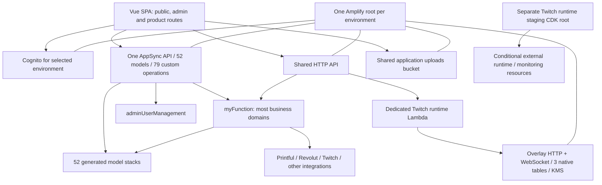

# Project Respawn architecture audit and proposal

Status: **Overall direction APPROVED; this document preserves the initial audit snapshot.** Phase 1 safeguards and current-source consolidation preparation are now implemented locally; see [Phase 1 results](phase1-implementation.md). No deployment or full migration is authorized by the architecture approval.

Audit date: 21 September 2026. Source baseline: `development`, HEAD `3cf3928`, with the pre-existing uncommitted local/auth fixes preserved. AWS inspection: account `058264289478`, region `eu-north-1`, using read-only calls. This is a regional inventory, not a claim to have inspected every account, region, or the Companion application's source. Evidence is a point-in-time snapshot; resolve live identifiers again before implementation.

## 1. Current architecture

The site is a Vue/Vite client application backed by one Amplify Gen 2 backend per deployed environment. One backend contains a single `defineData` schema, 52 models and 79 custom operations. Most custom operations run through the same `myFunction` Lambda; eight use `adminUserManagement`. Splitting schema source files alone would not split this deployment.



Physical ownership today is root -> auth/data/storage/function/api-stack/overlay-source-stack; data -> model stacks, connection/support stacks and FunctionDirectiveStack. `backend.createStack()` produces nested stacks in that root. The separate `infrastructure/twitch-runtime` CDK application is a different deployment unit. The standalone overlay synth application is a review harness; it does not prove an independently deployed overlay service exists.

Actual environments differ from the supplied historic name:

| Environment | Observed root / hosting | Meaning |
| --- | --- | --- |
| Production | `amplify-d2cux232bpa951-master-branch-53ef67772a` | Amplify `master`, PRODUCTION, auto-build enabled |
| Staging | `amplify-d2cux232bpa951-staging-branch-8b38605406` | Amplify `staging`, stage NONE, auto-build enabled |
| Demo | `amplify-d2cux232bpa951-Demo-branch-e6d14a6927` | Amplify `Demo`, auto-build disabled; older schema |
| Current local | `amplify-projectrespawnwebsite-Ntgre-sandbox-8bd9d02332` | `Ntgre`, verified by current outputs and validator |
| Other local | `amplify-projectrespawnwebsite-Daniel-sandbox-bbfa03cf7c` | Separate sandbox; do not treat as this workstation |
| Legacy local | `amplify-projectrespawnwebsite-Ntgrestage8-sandbox-583d036e70` | Still exists; distinct from previously deleted `...767a43f84e` root |
| Failed historical branch | `amplify-d2cux232bpa951-development-branch-62707e873c` | ROLLBACK_COMPLETE; no current website hosting branch named development |
| Companion | App `d115kibncg450`, branch `Live-Version-AWS` | Separate WEB app; branch response contains no linked backend stack |
| External runtime | `ProjectRespawnTwitchRuntimeStaging` | Root exists; Environment tag says Ntgrestage8, inconsistent with name |
| Adjacent infrastructure | `swg-private-test`, `CDKToolkit` | Included in regional inventory; not assumed owned by website backend |

The currently loaded local pool is `eu-north-1_n24iLL7QE`. The requested shared account pool `eu-north-1_Uufjxul58` remains production-owned. Prepared `referenceAuth` code is opt-in, defaults to managed auth, and blocks shared mode on local/master. This audit has not enabled it, moved users, or changed generated outputs.

## 2. Current CloudFormation inventory

See the complete [stack catalogue](cloudformation-inventory.md), [stack CSV](evidence/stack-inventory.csv), [root totals](evidence/root-summary.json), and [evidence guide](evidence/README.md). They identify physical and logical resources, types, outputs, nested parents, references and dependencies. Counts are template declarations, including metadata/custom resources; they are not counts of billable services. Conditional resources may not exist physically.

| Root family | Templates | Declared resources across family | Largest template |
| --- | ---: | ---: | ---: |
| master | 62 | 2,936 | 475 |
| staging | 62 | 2,936 | 475 |
| Ntgre | 62 | 2,929 | 475 |
| Demo | 46 | 2,143 | 355 |
| Daniel | 46 | 2,136 | 355 |
| legacy Ntgrestage8 | 35 | 1,575 | 307 |
| failed development | 1 | 12 | 12 |
| TwitchRuntimeStaging | 1 | 20 | 20 |
| CDKToolkit | 1 | 14 | 14 |
| swg-private-test | 1 | 19 | 19 |

The inventory covers 317 stacks across ten roots, with no unresolved collection gaps. SWG's independent YAML template is also preserved separately. The failed development root's declarations do not establish that its rolled-back child resources are live.

Production's 2,936 declarations include **1,678 AppSync function configurations, 557 resolvers, 132 data sources, 52 custom-managed model tables, three native DynamoDB tables, 12 Lambdas, 156 IAM roles, 98 IAM policies, 61 nested-stack resources and 62 metadata resources**. Lambda count alone is a poor sizing metric. Three S3 buckets include generated schema/code assets as well as application uploads; they are not three interchangeable user-storage domains.

Production's immediate children contain auth 37, data 86 (including 55 nested children), shared HTTP API 49, runtime function 4, overlay 43 and storage 12 resources. Model-generated resources and function directives dominate the deeper tree. The full catalogue supplies each model stack's actual count; do not assume one table costs one resource.

### Recent consolidation: actual status

The 475 -> 167 candidate exists in `.codex-worktrees/shared-handler-alias-candidate`, with review evidence in `.candidate-analysis/FINAL-CANDIDATE-REVIEW.md`. It is **not in the current main-checkout schema or these live production/staging/local templates**. This corrects an important premise without undoing any working changes.

The candidate maps 79 custom operations to two named handler references via `defineData.functions`. It deliberately retains `FnSubmitInvestorAccessRequest` and `FnReviewInvestorAccessRequest` as anchors. It keeps 79 authorization functions and 79 resolvers, while reducing invocation functions, data sources, roles and policies from 79 of each to two of each. That removes 308 declarations, with 167 remaining in FunctionDirectiveStack. Historical review recorded zero additions, 308 deletions and 81 updates; 12 Lambda asset references were unchanged. Those proofs belong to historical baseline `7838e2b30a1cc518c1cd13e377c15cf7d17a9595`, not this current dirty checkout.

Historical production total was **2,936 -> 2,628**, still over the fresh-create ceiling. Rebase and re-prove the candidate; do not blindly copy its lockfile or assume historical passing checks apply. Preserve the already implemented Team Hub `readTeamHub` / `mutateTeamHub` gateway boundary. Do not turn every new Team Hub action back into a separate generated Lambda directive.

## 3. Problems and scaling risks

1. **Two different CloudFormation constraints.** A template is limited to 500 resources; a nested hierarchy can involve at most 2,500 resources in one create/update/delete operation. Existing large trees can survive small updates, while a fresh create or broad update fails. More nested templates only address the first constraint. See [AWS quotas](https://docs.aws.amazon.com/AWSCloudFormation/latest/UserGuide/cloudformation-limits.html) and [budget policy](cloudformation-boundaries.md).
2. **One lifecycle for unrelated domains.** `amplify.yml` runs `ampx pipeline-deploy` for hosted builds. A frontend-only commit can still synthesize/deploy the shared backend. An unchanged resource need not update, but every product remains exposed to shared synthesis, validation and deployment failure.
3. **Generated data is the larger long-term growth source.** Function consolidation is valuable but leaves hundreds of generated model pipelines/resolvers. Adding models across every product to one `defineData` repeats the hierarchy problem.
4. **Broad execution and authorization surface.** `myFunction` handles forum, commerce, workspace, application, investor and Team Hub paths, plus external credentials. Schema-level `allow.resource(myFunction/adminUserManagement)` grants query/mutation capability broadly. `amplify/backend.ts` grants the admin function Cognito actions on `*`. These are least-privilege review targets, not proof of an exploitable authorization bypass.
5. **Eager frontend loading.** 91 static Vue imports in route modules versus 21 dynamic imports. Admin imports also pull Team Hub administration into the eager graph. The router eagerly imports the Team Hub service. ESM imports execute before `Amplify.configure` in main.js, explaining early client initialization warnings.
6. **Configuration/environment drift.** Hard-coded Twitch callback endpoints, runtime staging tags naming Ntgrestage8, old sandbox roots and inconsistent branch labels hinder safe targeting. Build validation correctly rejected the current local API URL mismatch; do not remove that guard.
7. **Stateful ownership is harder than source organization.** Generated tables use `Custom::AmplifyDynamoDBTable`; removing a model is not a safe native-table import workflow. Data relationships, IAM bindings, outputs, bucket grants and KMS ciphertext must survive any later extraction.
8. **Incomplete repeatability evidence.** Historical candidate clean-install tests are not current-checkout proof. A runtime ownership test currently expects a separate synthesis directory. CI and test fixtures must report which source/dependency/template revision was tested.

## 4. Proposed architecture

```text
Project Respawn
  Core
    Identity; Directory and Authorization; Media; Configuration/Observability
  Community
    Forums; future community features (profiles consume Core)
  Esports
    Team Hub; Tournaments; Drafting; Broadcast; Competitive History
  Creators
    Workspaces; Twitch Connections/Automation; Overlay Delivery; Discord
    Partner Hub (frontend module initially)
  Games
    Companion (separate application contract); SWG tools; future game modules
  Events
  Commerce
    Catalog; Checkout/Fulfillment
  Operations
    Applications/Bookings; Investor Access; Trainer/Therapist frontend modules
  Admin (privileged presentation and narrowly scoped operations)
  Public Website (marketing, navigation and account entry)
```

This is logical ownership, **not a command to instantiate a stack for every box**. Drafting, Broadcast and competitive history start as Tournament modules until their runtime/permissions/lifecycle justify separation. Do not invent tournament databases for the existing fixture-only adapter. Trainer/therapist/partner pages do not establish deployed matching backend models.

Keep established feature directories initially. Move toward `src/core`, `src/features/<domain>/<module>` and `infrastructure/domains/<domain>/<module>`, using thin public contracts. Names such as `Team Hub` can be normalized in a separate tested source-only change; do not couple a folder move to construct-ID changes. Keep `amplify/data/resource.ts` as the legacy schema composition while it owns deployed models.

## 5. Proposed AWS stack map

Names below use `{env}` as an explicit validated environment slug. These are **future sibling root deployment units**, not all children of a new mega-root. Estimates are planning ranges for a small custom API/Lambda/table implementation including IAM/logging/alarms; generated Amplify model costs must be measured separately. They are not synthesized promises. Create a unit only when needed.

| Proposed logical/stack name | Responsibility and existing candidates | Dependencies | Initial estimate | Growth / migration |
| --- | --- | --- | ---: | --- |
| Existing Amplify root, labelled LegacyPlatform | Preserve all currently owned stateful resources and API compatibility | Existing graph | 2,936 production now; historical alias candidate 2,628 | Critical create-size debt; progressively stop adding domains |
| ProjectRespawn-Core-Identity-{env} | One platform identity authority; current auth 37-resource subtree, pool/groups/triggers | None of the product stacks | 35–70 | Low growth; **logical boundary only initially**, no pool transfer |
| ProjectRespawn-Core-Directory-{env} | UserProfile, permissions, Brand/access directory | Identity contract | 70–180 | Medium; stateful models stay legacy until proven transfer |
| ProjectRespawn-Core-Media-{env} | MediaCollection/MediaItem, upload authorization, asset references | Identity/Directory IDs | 40–120 | Medium; preserve existing bucket/keys; future storage grants scoped |
| ProjectRespawn-Core-Operations-{env} | Configuration registry, minimal shared events if needed, platform dashboards | Endpoint metadata from owners | 20–80 | Low/medium; new resources only initially; domain alarms stay with domain |
| ProjectRespawn-Community-Forums-{env} | Six forum models and forum service operations | Identity; profile contract | 90–220 | High generated cost; legacy tables remain in place first |
| ProjectRespawn-Esports-TeamHub-{env} | Four Team Hub models, read/mutate gateway, logo grants | Identity; Directory/media contract | 60–150 | Medium/high; authorization and gateway tests preserved |
| ProjectRespawn-Esports-Tournaments-{env} | Future registrations, matches, drafts, broadcast metadata | Identity; Team Hub read contract | 60–180 | High growth; new backend, no current tournament tables to move |
| ProjectRespawn-Creators-Workspaces-{env} | Four workspace models, membership policy enforcement | Identity; Directory | 60–150 | High security sensitivity; no premature physical migration |
| ProjectRespawn-Creators-Twitch-{env} | Eight Twitch/reward/nonce models, scoped provider operations | Identity; workspace authorization contract | 80–200 | High; secrets/token encryption, nonce and dedupe continuity |
| ProjectRespawn-Creators-Overlay-{env} | Existing overlay 43-resource subsystem; dedicated runtime integration | Workspace contract; Twitch events; credential key | 45–100 | High; retain three tables/key and browser-source URLs |
| ProjectRespawn-Creators-Runtime-{env} | Existing standalone Twitch runtime staging responsibility | Twitch/overlay contracts; secret references | 20–90 | Medium/high; source flags mean declared is not running capacity |
| ProjectRespawn-Creators-Discord-{env} | DiscordBotConfiguration and future worker | Identity; workspace IDs | 15–60 | Low now; keep in Creators unit until independent worker warrants root |
| ProjectRespawn-Games-SWG-{env} | Future server-backed SWG features | Identity only if required | 0 now; 20–80 if backend needed | Low; current frontend tool needs no new AWS stack; do not absorb swg-private-test blindly |
| ProjectRespawn-Games-Companion-{env} | Integration contract for separate hosting app | Shared identity; versioned game API | Undetermined; separately audit repo | Unknown; no invented table migration |
| ProjectRespawn-Events-{env} | Event, EventTag, EventSuggestion and service | Identity; profile/workspace IDs | 40–100 | Medium; cross-domain event consumers have no table-write authority |
| ProjectRespawn-Commerce-{env} | Seven commerce models, Printful/Revolut checkout, webhooks | Identity; Brand/media contracts | 90–220 | High; begin Catalog and Fulfillment as modules, split lifecycle later |
| ProjectRespawn-Operations-Applications-{env} | Seven application models, booking/application orchestration | Identity; scheduling contracts | 70–180 | High; personal data, idempotency and audit continuity |
| ProjectRespawn-Operations-Investors-{env} | Three investor-access models, access audit and expiry | Identity; scoped admin authorization | 40–100 | High; sensitive access boundary |
| Public Website / Admin / Partner / Trainer / Therapist | Frontend modules; domain owners retain data and backend authorization | Required domain endpoints only | 0 additional backend resources by default | Do not create another catch-all admin or integrations backend |

The installed `@aws-amplify/backend-data/lib/factory.js` explicitly rejects multiple `defineData` calls in one backend. Therefore new independent units should use separately deployed CDK services (HTTP API/Lambda/DynamoDB by default, AppSync when its features justify the generated cost), or separately managed Amplify backends after proving auth/client integration. Calling `createStack` several times is not independent deployment. See [Amplify custom resources](https://docs.amplify.aws/react-native/build-a-backend/add-aws-services/custom-resources/) and [data factory source](https://github.com/aws-amplify/amplify-backend/blob/main/packages/backend-data/src/factory.ts).

## 6. Shared/Core resources and cross-domain contracts

One person has **one platform account across all products**. Keep the existing production Cognito pool authoritative; domains validate its issuer and allowed client/audience, then enforce their own resource permissions. A user pool is not a DynamoDB sharing policy. The earlier request to share accounts across branches while isolating branch data remains the target, but requires a separate reviewed auth rollout. Do not silently switch the local sandbox or copy production users.

The prepared shared-auth manifest reuses the production identity pool and group IAM roles as well as its user pool/client. Enabling it indiscriminately can expand production role permissions across branches. Prefer environment-specific app clients and scoped data-access roles/identity-pool arrangements, with explicit trust/audience tests and compatible Amplify outputs. Verify the supported integration before rollout; `referenceAuth` alone does not guarantee that isolation. See [Amplify existing Cognito integration](https://docs.amplify.aws/vue/build-a-backend/auth/use-existing-cognito-resources/) and [existing migration proposal](../shared-cognito-migration.md).

Global ownership: identity, stable `sub` identifiers, minimal profile, permission vocabulary, Brand directory, configuration contracts and shared media identity. Product-specific membership, moderation, team roles and workspace entitlements remain with the product. Shared storage may remain physically shared initially, with domain prefixes and scoped grants; never make all data globally writable because login is shared. No universal execution role or universal business Lambda is required.

All 52 models are assigned in [data ownership](data-ownership.md). CROSS-DOMAIN means one owner with external references, not joint write access. Existing generated `belongsTo`/`hasMany` joins cannot simply cross independently deployed GraphQL schemas.

| Interaction | Proposed contract | Failure/consistency rule |
| --- | --- | --- |
| Tournament -> Team Hub | `getTeamEligibility(teamId, tournamentId, version)` plus roster snapshot | Tournament owns registration; snapshot freezes agreed roster; timeout fails registration safely |
| Creator -> Events | `createEvent` command with workspaceId, actor sub and idempotency key | Events validates workspace capability via contract; retries do not duplicate events |
| Community -> Profile | Public profile projection keyed by sub | Deleted/hidden users render safe placeholder; private profile data excluded |
| Companion -> Account | Same issuer/subject with its own allowed client | No password copying or direct user-table writes; Companion backend remains separate audit |
| Commerce -> Brand/Media | Read approved Brand/asset descriptors; store immutable order snapshot | Order history survives later catalog/profile edits |
| Twitch -> Overlay | Versioned event with workspaceId, eventId, occurredAt, schemaVersion | Idempotent consumer, dedupe retention, retry/DLQ and replay authorization |

Use synchronous owner APIs for immediate authorization and commands; use events for projections/notifications where eventual consistency is acceptable. Do not rely on delayed events alone to revoke privileged access. Event contracts need producer, schema, PII policy, idempotency, ordering scope, retry/DLQ, retention and version compatibility. Add a shared bus only when actual consumers justify it.

Stable Core dependencies may use explicit CloudFormation references where lifecycle coupling is intentional. Domain-to-domain dependencies should normally use versioned endpoint/configuration contracts (for example an environment-scoped SSM registry resolved by deployment tooling), not reciprocal table grants/exports. Registry publication needs owner, revision, readiness and account/region/environment validation. SSM is not an authorization boundary and values do not automatically refresh deployed consumers. ImportValue creates a removal/update dependency; do not build a mesh of exports. CDK's support for newer weak stack-output references must be verified against installed tooling before adoption; it does not replace readiness or IAM checks.

## 7. Frontend module plan

The detailed [frontend plan](frontend-modules.md) maps actual URLs, import findings, initialization order and acceptance tests. Preserve existing paths such as `/forum`, `/creator-tools`, `/team-hub`, `/tournaments/:tournamentSlug` and `/swg-beyond-buff-builder`; the proposed domain taxonomy is not a URL migration.

Measured production build: main JS **2,322.65 kB minified / 603.51 kB gzip**, 10.70 seconds in this workstation run. These are build artifact measurements, not browser LCP or network benchmarks. Route lazy loading and deferring domain SDKs can reduce initial transfer/evaluation. Moving CloudFormation stacks cannot do that by itself.

## 8. AWS naming convention

See [naming standard](aws-naming.md). Improve logical ownership, documentation and supported tags first. Use `ProjectRespawn-<Domain>-<Module>-<environment>` for future explicit stacks; leave current Amplify-generated names and physical stateful names intact. Construct paths/logical IDs are resource identity, not decoration.

## 9. Migration plan

See [migration and validation plan](migration-plan.md). Exact recommended order:

1. Review this architecture, verify owners/environments, establish recoverable backups and pin source/dependencies/template evidence.
2. Add manifest-aware resource budgets and contract tests; re-prove the handler alias candidate against the current baseline without weakening authorization.
3. After a separately approved change review, apply that consolidation in place to the intended environment; it is a bounded improvement, not the full fresh-create solution.
4. Implement route lazy loading and safe Amplify/client initialization independently of infrastructure moves.
5. Establish one independently deployable new product backend, preferably the currently fixture-only Tournament service, with shared identity and explicit Team Hub contracts.
6. Introduce domain façades and extract selected stateless execution paths, preserving current physical tables/API compatibility; prove scoped permissions and rollback.
7. Transfer stateful ownership only through a demonstrated, separately approved import/refactor strategy. Keep unsupported custom-managed resources where they are.
8. Retire unused compatibility paths only after consumer verification and an approved retention window. Rehearse an isolated fresh-create of the new deployable topology before claiming the hierarchy problem solved.

The shared-account/branch-isolation rollout has its own dependency/security gates; do not bundle Cognito changes with table extraction or handler consolidation.

## 10. Risk matrix

| Move | Risk | Classification and constraint |
| --- | --- | --- |
| Docs/module interfaces/tests | LOW | SAFE TO MOVE source; no construct identity changes |
| Lazy route imports/client initialization | LOW–MEDIUM | Source only; route guards, direct links and stale chunk recovery must pass |
| Handler alias consolidation | MEDIUM | Generated resolvers/IAM change; re-prove zero stateful replacement and identical authorization |
| New standalone Tournament service | MEDIUM | New deployment, no existing tournament data; contract/auth rollout required |
| Dedicated stateless function/alarms | MEDIUM | CAN BE RECREATED only after checking URLs, event sources, credentials and consumers; logs may have retention obligations |
| AppSync API/endpoints | HIGH | SHOULD NOT BE MOVED initially; clients/schema/auth/codegen tied to identity |
| Native overlay tables | HIGH | STATEFUL; REQUIRE verified resource import/refactor/retention strategy |
| Generated model tables | CRITICAL | Custom provider owns lifecycle; do not remove models or treat as native importable resources |
| S3 uploads/media | CRITICAL | Preserve bucket/key/access URLs; retention plus verified restore, object versions and IAM policy mapping |
| Cognito pool/groups/identity roles | CRITICAL | SHOULD NOT BE MOVED/recreated for naming; users/subs/triggers/trust preserved; cross-branch roles reviewed |
| KMS keys/Twitch token vault | CRITICAL | Preserve key identity and decrypt grants; retention alone is insufficient if grants break |
| Commerce fulfillment/webhooks | HIGH | Idempotency, reconciliation and stable callbacks required; no duplicate charges/orders |
| Workspace/Team Hub authorization | HIGH | Prove revocation, tenant boundaries, capability checks and deny cases before cutover |
| Existing standalone runtime | HIGH | Discover actual managed/external ECS ownership first; source conditional defaults are not deployment permission |

## 11. Validation plan

The [validation ledger and commands](migration-plan.md#validation) distinguish executed tests from required future gates. This audit's local outputs, Amplify contracts, 16 guard tests, 47 Team Hub backend tests and 24 Team Hub frontend/Tournament tests passed. TypeScript completed without diagnostics. Fresh master-managed synthesis produced 62 templates / 2,936 resources. Production build passed with process-only audit environment values after the default build correctly detected a stale local API URL. No payment transaction was tested. The initial runtime-ownership suite had 2 passes/1 failure because its expected synthesized root file was absent; all three identical assertions passed against the fresh audit assembly using a temporary copy with only its fixture directory adjusted. The repository test was not changed.

`npm ci` and authenticated production workflows were not run as part of this audit. Historical candidate test failures remain documented, not waived. Do not call this checkout release-ready based on an architecture report.

## 12. Proposed future file changes

| Area | Future files / intent |
| --- | --- |
| Resource accounting | Extend `scripts/validate-amplify-stack-size.mjs`; add manifest/root-operation accounting and budget manifest/tests |
| Consolidation | Carefully port candidate `amplify/data/resource.ts` alias bindings; dependency changes only if separately proven necessary |
| Frontend loading | `src/main.js`, `src/router/{index,public,admin,forum}.js` / existing `.routes.js` files, feature route modules; domain service initialization |
| Contracts | New `src/core/api` / domain public interfaces and matching backend contract schemas; maintain existing generated client during transition |
| Backend boundaries | New `infrastructure/domains/<domain>/<module>` entrypoints; later scoped replacements for `amplify/myFunction` handlers |
| CI | `amplify.yml`, `package.json`, domain pipeline definitions; reproducible installs, selective deployment, outputs provenance |
| Identity | Existing `amplify/auth/{resource,mode}.ts`, shared manifest and guards only in separately approved auth migration |
| Data | `amplify/data/resource.ts`, backend grants/outputs only after physical ownership strategy is proven |
| Naming | Environment registry/tag helper for future resources; no mass construct/physical renaming |

Actual audit deliverables are documentation/evidence and the future-feature rule linked from AGENTS.md. No application, production configuration, permission or infrastructure implementation was changed for this audit.

## 13. Architecture decision records and growth answer

See [proposed ADRs](decisions.md) and the [mandatory future-feature assessment](adding-a-new-feature.md).

**Yes, the proposed architecture can support several times today's platform size without recreating one giant CloudFormation deployment, provided independent roots and budgets are enforced.** Logical subdomains can grow into independent units when lifecycle/security/size warrants it. Shared identity and versioned contracts avoid duplicating accounts or centralizing every model. New products stop adding their resources to the legacy hierarchy; per-root/per-template accounting prevents merely hiding the same problem behind more nested stacks.

This is conditional, not unlimited capacity: each unit still has service quotas and deployment limits, and the legacy 2,936-resource tree remains a fresh-create risk until reduced or safely decomposed. The 167-resource candidate alone does not solve that. Independent root pipelines reduce infrastructure blast radius and repeated synthesis; lazy-loaded routes improve browser performance independently. More roots add operational/configuration overhead, so split by measured need, not by menu item.
