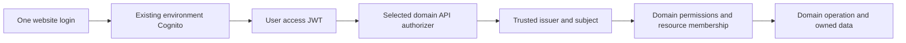

# Project Respawn domain architecture standard

Effective 4 October 2026. **Mandatory for every substantial new section and every extraction from LegacyPlatform.** This is a repository architecture decision, not deployment or migration authorization. Phase 2A Release 2 is paused. This task changes documentation only: no AWS operations, synthesis, deployment, implementation or data movement.

**One website, one shared identity authority per environment, multiple independent product domains.** One login serves authorized products within that environment. Ntgre, staging and production identities are not interchangeable. No product gets its own Cognito pool merely because it gets an independent API.

Companion documents: [complete classification](project-respawn-domain-classification.md), [mandatory checklist](new-domain-checklist.md), [migration roadmap](domain-migration-roadmap.md). This extends the [substantial-feature rule](adding-a-new-feature.md) and adopts the [deployment/runtime security decision](domain-deployment-runtime-security.md).

## Evidence and current limits

The [30 September website audit](full-website-domain-audit-2026-09-30.md) is the source for current website ownership, routes, dependencies and performance. It is not a completed live business-health certification. The [Phase 2 plan](phase2-domain-decomposition-plan.md) supplies the dependency and stateful-migration analysis. The [4 October Release 1 acceptance](phase2a-tournament-runtime-kms-release1-acceptance-2026-10-04.md) supersedes their earlier Tournament failure/planned-count statements only where later evidence exists.

Tournament now has an independently deployed root/API/Lambda, uses existing Ntgre identity and has proven live preview authentication and strict runtime isolation. Its root has **11 resources**. It has no business tables and no frontend cutover. Its main website pages remain fixtures. **Release 2 and rollback to Release 1 remain unproved.** Most other products still share LegacyPlatform's schema, handlers, IAM and deployment hierarchy. LegacyPlatform's last verified baseline is **2,621 resources / FunctionDirectiveStack 167**; this documentation task does not refresh AWS evidence.

Current source examples are `src/features/tournaments/`, `domains/tournaments/`, `infrastructure/domains/tournaments/{app,stack}.ts`, `scripts/domains/{lib,select,plan,deploy}.mjs`, environment contracts, and the [accepted endpoint manifest](../../config/domains/tournaments/domain-endpoints.Ntgre.json). They demonstrate bounded pieces, not a universal finished platform. Historical security/bootstrap documents must not be blindly redeployed. The original `deploy.mjs` produces a review artifact; it is not a general execution command.

## 1. Ownership and the new-domain decision

Every feature MUST have one accountable product owner, authoritative data owner and module. Classify it before code changes as Shared/Core, an existing domain module, a justified independent domain, or frontend-only. Unresolved ownership blocks infrastructure creation, not further design.

A new independent domain normally needs several demonstrated reasons: distinct business capability, authoritative data boundary, independent release/rollback lifecycle, meaningful growth, different runtime permissions, useful failure containment and a coherent public API. Record evidence and rejected alternatives in the feature/PR architecture note; no arbitrary numerical score replaces judgment. An owner, operational capacity, contracts and resource budget are required.

A page, menu item, Cognito group, table, handler or large folder does not independently justify a root. Tournament brackets/matches/drafting are Tournament modules; Creator analytics/overlays/profile tools normally belong to Creator; Team roster/pools/coaching belong to Team Hub. Frontend-only marketing and projections do not require backend roots. One logical domain may have more than one deployable unit only where an additional runtime/lifecycle boundary is justified, as may apply to Creator control versus persistent delivery. Every such unit still has explicit ownership and contracts.

Existing coupled code is recorded migration debt, not implied compliance. Do not make unrelated migrations a prerequisite for a small repair. Substantial new domain behavior MUST NOT enter LegacyPlatform by default. A temporary compatibility exception requires a named owner, narrow scope, reason, security/resource analysis, exit condition and review milestone; it cannot silently become the target architecture or authorize resource changes.

## 2. Shared/Core: a bounded responsibility

Core physically remains within LegacyPlatform initially. Logical Core ownership does not imply a new Core stack, a pool move, or ownership of every currently shared Lambda/provider.

| Core owns | Boundary |
|---|---|
| Identity authority and account lifecycle | Existing environment Cognito pool/client/groups and the explicitly privileged identity-administration service; stable subject and session contracts |
| Minimal global profile | Canonical subject reference, display name, avatar asset reference, locale/time zone, genuine website-wide preferences; field-level update rules |
| Global identity/access vocabulary | Permission identifiers, platform-level role definitions and audited global grants where genuinely global; domains still make resource decisions |
| Bounded directory | Stable Brand/organization identifiers and minimal public labels only where multiple domains require shared ownership; shared affiliation is distinct from product permission |
| Configuration discovery | Versioned environment identity and owner-published endpoint descriptors; no universal business router |
| Website shell | Login/session plumbing, navigation, shared design primitives, error boundaries and small global accessibility/preferences state |
| Justified shared media capability | Asset registry and narrowly authorized upload/read intents for genuinely shared assets; see media rule below |

Core does **not** own team rosters, competition state, creator integrations/OAuth tokens, product orders/payments, forums/moderation decisions, applications/reviews, investor approval/NDA/expiry, or future coaching/clinical records. Common libraries must be pure/versioned contracts or utilities, not a giant shared business Lambda, mutable store or universal data client. Existing shared infrastructure providers are transitional physical dependencies, not reasons to put business capabilities in Core.

A new Core field/service requires identified consumers from multiple domains, a stable minimal contract, one writer/authority, sensitivity and revocation rules, and proof that an owner API is insufficient. Merely displaying a product summary on the homepage does not transfer ownership to Core. Do not prebuild shared notifications, queues, event buses or other platform services without actual consumers.

## 3. Account and profile contract

The canonical identity is Cognito `sub`, scoped by the validated issuer/environment; use `(issuer, sub)` where identities from different environments might otherwise collide. Email, display name and request-body user IDs are not stable security identifiers.

Core owns the minimal global profile above. Cognito email/verification and account status remain identity-controlled attributes, not arbitrary UserProfile edits. Core exposes an allowlisted profile update contract with self/admin authorization, version/conflict checks and an audit trail for privileged changes. Domains MUST NOT freely mutate the global `UserProfile` table.

Domain extensions reference the subject and remain domain-owned: Creator bio/channel/provider links; Team player membership/roster/coaching; Tournament registration/preferences/eligibility snapshots; Commerce delivery/order information; Community activity/moderation; Applications answers/reviews; Investor access/NDA decisions. Product-private data must not be copied into a global profile for convenience. Account pages compose approved summaries through owner contracts and tolerate a product being unavailable.

## 4. Frontend, routes and client lifetime

Use the repository's Vue feature model, conceptually:

```text
src/features/<domain>/
  routes/       # thin route metadata and dynamic imports
  pages/
  components/
  composables/
  services/     # domain orchestration, not another domain's internals
  api/          # explicit endpoint and token-provider client
  contracts/    # frontend validators/types, or versioned owner exports
  state/        # domain-local state, constructed on demand
domains/<domain>/            # backend business logic/contracts/runtime entrypoints
infrastructure/domains/<domain>/  # isolated CDK app, stack, package/lock/toolchain
config/domains/<domain>/     # accepted environment endpoint manifests
```

Equivalent existing paths are acceptable when ownership/dependency rules are clear. This is a template for future work, not an instruction to move files now. Do not duplicate conflicting schemas across these directories: publish owner contracts and consume the same version.

Major route layouts AND pages MUST load dynamically. `/tournaments/*`, `/team-hub/*`, `/creator-tools/*`, `/merch` and `/checkout` select their domain chunks. `/store/*` is a possible future alias, not today's Commerce route or an authorized URL change. Preserve current URLs, aliases, deep links, route guards and redirects during refactors.

Global route registration may import lightweight metadata and loader functions, never eager product pages, stores or SDK initialization. Shared session guards must not initialize Team/Creator/Commerce services. Load domain access adapters only when entering their domain. Route hiding is user experience, not backend authorization.

API clients MUST be created on domain entry/first use with the domain endpoint and a shared token-provider callback. Do not store token snapshots indefinitely, embed credentials in manifests, call a different product's internal client, or repeatedly invoke global `Amplify.configure()` to switch products. Shared auth is configured once. Domain state must reset appropriately on logout/account switch. Shared navigation stores descriptors and permissions, not imported implementations of every product.

Opening Tournament must not download/evaluate unrelated Creator/Team/Commerce implementation through the shell or initialize their clients, except an explicitly reviewed consumed contract. Public projection data is obtained through a bounded contract, not by bootstrapping another product's entire frontend.

## 5. Authentication and domain authorization



Every protected domain consumes the existing environment's issuer and approved client contract. Validate signature, issuer, intended audience/client, expiry and token purpose; use scopes where part of the API contract. Backend handlers derive identity from trusted authorizer context and bind it to domain authorization. Never accept a request JSON `userId`, email, role or tenant as proof of the caller's authority. Resource IDs supplied by callers must be checked against their permissions.

Cognito authentication does not imply Team membership, Tournament eligibility, Commerce order ownership or Investor access. Global groups and domain memberships are separate inputs. Revocation-sensitive decisions require current authoritative policy, not indefinite cached group claims or eventually consistent snapshots. Define expiration/caching behavior explicitly. Reject unauthenticated callers, wrong environment/client/token purpose, expired claims, other-resource access and unauthorized administrators.

Products MUST NOT administer Cognito; explicitly authorized Core account-management operations own that capability. No duplicate per-domain pools or manual output-ID substitutions. Public read APIs and provider webhooks may use separately documented authentication modes, with explicit method/operation authorization; they are not blanket exceptions to identity checks. Existing SWG ID-token behavior needs a compatibility review before adopting the access-token standard there.

## 6. API and data ownership

Every independent domain owns its API, handler package, business logic, domain authorization and business data where it has data. Choose versioned HTTP or an independent GraphQL API based on needs. Do not force a replacement universal AppSync graph, API gateway or giant dispatcher across products. Stateless proofs such as Tournament Release 1 need no speculative database.

Each table/object/event has one authoritative owner and one cutover writer. Product runtimes MUST NOT normally access another domain's tables directly. Tournament asks a Team Hub eligibility/summary API; it does not query or mutate roster tables. Refer to stable team/subject IDs; retain explicitly versioned snapshots only where historical business meaning needs them. Snapshots are not live authorization sources.

Core exceptions are bounded, reviewed capabilities: minimal public directory/profile projections through Core APIs, or scoped asset operations described below. Direct Core data access is exceptional and requires named data/actions/columns or prefixes, one owning writer, sensitivity and revocation review, and a reason an API cannot serve it. No generic Core table access, cross-domain writes, arbitrary Cognito admin or global mutable data client. A transitional adapter to legacy-owned product tables must be recorded as such; it does not prove physical extraction.

All physical transfers require a separate resource-specific plan. Existing 52 generated tables are `Custom::AmplifyDynamoDBTable`, not ordinary native tables. A source move, imported handle, name reference or Retain policy is not an ownership transfer. Inventory readers/writers, indexes, transactions, streams, TTL, keys, providers, backups/restore, delete behavior, encryption, URLs and compatibility before authorizing a migration. Preserve Cognito identity and existing protected state. No two stacks manage the same resource and no uncontrolled dual business writers.

## 7. Cross-domain contracts

Use authenticated, versioned HTTP/GraphQL APIs for synchronous decisions. Service calls use narrowly scoped service identity or an explicit delegated-user contract; do not copy caller-supplied claims into trusted context. State who authenticates the service, who authorizes the end user, which identifiers can be forwarded, and how failures/timeouts are handled. Sensitive domains fail closed for authorization.

Contracts define owner, version, schema, stable identifiers, auth mode, permission checks, errors, pagination, concurrency/idempotency, compatibility window and deprecation policy. Breaking changes require expand/contract rollout and previous-version support; additive contract updates select consumer tests, not automatic deployment of every product.

Introduce events only for real asynchronous consumers. Specify event ID/type/version, producer, subject/resource references, timestamp, data classification, ordering assumptions, idempotency, retries, dead-letter handling, replay and deletion/retention behavior. Do not put tokens, secrets or unnecessary personal data in events. Do not build a speculative global bus or use eventually consistent events as the sole authorization/payment decision.

Prohibited target dependencies: cross-domain database access, imports of another domain's infrastructure or business implementation, giant shared Lambdas, global mutable API clients, and CloudFormation exports/imports tying product roots together. Pure owner-published contract packages are allowed with pinned versions and no infrastructure/SDK side effects.

## 8. Admin and media

Admin is a cross-domain administration UI, not an all-permission backend. `/dashboard` loads domain admin modules lazily. Domain APIs authorize and audit their own administrative operations. Core retains account/global permission administration only. SuperAdmin UI visibility does not give a Tournament Lambda access to Commerce, Cognito or another domain's database. A domain admin view failing must not broaden permissions elsewhere.

Media is classified by purpose. Shared brand/avatar/reusable public assets may use a bounded Core media registry and authorized upload/download intents. Team logos, Tournament assets, Creator publications and Commerce product-image associations retain explicit product ownership even if a scoped shared storage capability supplies bytes. Investor/private applications/clinical data and provider secrets are not public shared media.

New domain-private storage should be owned by that domain when justified. Existing shared storage stays physically in place until reviewed migration. Scope every shared grant by action and identity/domain prefix, content restrictions and environment; use short-lived authorized URLs where appropriate. Define asset ownership, metadata, validation/scanning needs, retention/deletion and access revocation. No universal read/write bucket grants, root-level shared uploads or silent bucket moves. A dedicated media root is not required merely because many pages display images.

## 9. Infrastructure, accounting and configuration

Every independent deployment unit MUST have its own entrypoint, CDK application, sibling CloudFormation root, isolated synthesis, dependency closure/lock, artifact, deployment selector/command, operational owner and rollback record. `backend.createStack()` below LegacyPlatform does not qualify. One CDK app instantiating all products does not qualify even if deploy selects one stack. Domain-owned nested stacks may partition its own root but do not create extra independent products.

Changing A must not require synthesizing or deploying B. Shared contract changes may require B's compatibility tests; redeployment requires actual changed inputs/behavior and its own authorization. Count generated resources, nested handles and descendants, assets/providers, resolvers, IAM, permissions, logs and alarms. Use existing [resource budgets](cloudformation-boundaries.md); do not confuse logical domain attribution with template limits or silently raise legacy debt allowances. Forecast growth before new state/schema construction. Isolation can add service overhead; no cost reduction is promised.

Keep genuine `amplify_outputs.json` for LegacyPlatform authentication/data/storage. Independent domains publish non-secret manifests containing domain/owner, environment, account, region, stack name/ARN, API identity, endpoint, auth mode, contract version, deployment revision and provenance. Bind identity configuration to the same approved environment and capture immutable input hashes. Validate the manifest before client initialization; reject planned/unverified endpoints, environment mismatches and unknown revisions.

Planned manifests MUST be clearly non-deployed and unusable for live calls. Publish an accepted endpoint only after authorized deployment/readback and live acceptance. The current Tournament manifest is the example; frontend consumption is a separate cutover. Environment/Core configuration supplies identities without instantiating Core or using cross-root constructs/exports. Optional SSM distribution needs an exact owner/read scope and a captured version for reproducible rollback; it is not required by this standard.

## 10. Deployment and runtime security

**Runtime: strict least privilege. CloudFormation execution: practical service-level permissions for the reviewed lifecycle.** Distinguish the deployment caller, CloudFormation service role and product runtime role. The caller selects only the approved root/environment and exact reviewed artifact/service role. Execution roles manage the required services with supported resource/action conditions, scoped PassRole and documented broader service exceptions. No AdministratorAccess/PowerUserAccess. Do not propagate execution privileges to runtime.

Every runtime role requires an effective permissions boundary and domain-scoped identity policy, with explicit business/cross-domain negative tests. Cognito admin, IAM/CloudFormation administration, unrelated S3/DynamoDB/secrets/KMS remain denied unless a separately justified owner capability specifically requires them. A boundary is a cap, not a permission grant; evaluate identity, boundary and relevant resource policies together.

Tournament's exact AWS-managed Lambda-key Decrypt exception adds zero KMS Allows and is supported by live evidence. Generalize the requirement to inspect real service-encryption needs, **not** that key ARN or an unrestricted KMS exception. Classify AWS service encryption separately from business keys; verify negatives for business and unknown keys, grants and administration. Do not invent unsupported conditions or treat an identity simulation alone as proof of live service authorization.

Production/environment protections, LegacyPlatform protection, artifact pinning, full change-set inspection, replacement/deletion review, restricted PassRole, rollback-enabled execution and post-deploy readback remain mandatory. Practical API Gateway permissions do not prove perfect account-wide isolation: requested region does not separate environments in one account, known-ID denies do not cover future resources, and tags alone are insufficient. Record residual scope and compensate through target/artifact/role controls. Broader exceptions require evidence and review, not copying Tournament's whole policy.

Hosted automation must guard both synthesis/accounting and the actual deployment invocation. Current `amplify.yml` still contains unconditional `ampx pipeline-deploy` when that workflow runs. Local Tournament selection proof is not hosted pipeline proof. The development branch is not AWS-connected per the user's workflow; staging/master are. Do not connect branches, alter pipelines or push a deployment-triggering change as a side effect of this standard. Production execution always needs explicit target-specific authorization.

## 11. Testing, observability and release evidence

Each domain must cover contracts, runtime behavior, identity/resource/admin negatives, cross-domain isolation, resource accounting, source/package/synthesis selection, manifest validation and live deployment/rollback. Tests must exercise behavior and failure controls, not merely mirror policy text. Preserve raw simulation discrepancies and resolve them with independent checks and eventual service evidence. A tampered JWT denial does not independently prove issuer/audience validation; pair safe live cases with configured authorizer and handler tests.

Before/after evidence must show unrelated roots/resources unchanged. For current Ntgre proofs use the recorded Legacy baseline, protected identities, hashes and timestamps. Data migrations add restore/reconciliation and old-client compatibility tests. Mark fixture-only behavior explicitly; a rendered page or successful stateless preview is not business workflow acceptance.

Every domain owns log groups/retention, request correlation, latency/error/invocation metrics, appropriate alarms, deployment revision markers, operational dashboard/runbook and an escalation owner. Log no JWTs, credentials or unnecessary personal/financial payloads. Sensitive state changes require domain audit events with actor/action/resource/outcome and retention controls. Alarm OK without traffic is not acceptance. Correlate authenticated behavior, runtime evidence and metrics. API access logging requires an explicit decision and scoped delivery permissions; Tournament Release 1's disabled access logs and user-approved platform-log alternative are documented exceptions, not universal defaults.

Release evidence must include a previous compatible immutable artifact/configuration and a rollback exercise. A successful first deployment does not prove a second release or rollback. A code rollback is not reversal of committed business data; specify data compatibility/reconciliation separately. Failures stop at the authorized scope; new IAM patches, state replacement or retries require whatever additional authorization their scope needs.

## 12. Measurable frontend gates

Historical audit baseline: **2,165.36 kB minified / 556.59 kB gzip** main JavaScript, 419 local files in the initial import closure; 23 lazy and 97 eager component records. It is a 30 September build measurement, not a fresh measurement here. Lazy Tournament pages still receive unrelated eager main-bundle code. Download/evaluation, client initialization and network traffic are separate measurements.

For each approved frontend extraction, capture reproducible before/after builds on the same tooling and routes (`/`, Tournament, Team Hub, Creator, Commerce, and domain admin entry). Report initial minified/gzip bytes, dynamic chunks, domain dependency membership, client initialization counts and actual request traces. Record cold/cache conditions; do not add all chunks and call that initial load.

Gates: all major domain layout/page entries dynamic; **zero unexplained unrelated product implementation imports in the entry closure**, **zero unrelated product-client initializations**, **zero unrelated product API calls** before explicit navigation/contract need; preserve auth/deep links; the extraction must reduce its unrelated entry contribution. Shared-shell total gzip must not regress without a measured, reviewed shared-capability reason. Same-environment test data and stable measurement conditions are required.

Do not impose an unevidenced 100 kB target or promise a speedup. First remove the measured eager dependencies, then set numerical shell/domain budgets from the resulting build with an owner and review threshold. A bundler's 500 kB warning is a signal, not an automatically justified product budget. Frontend-only work must not trigger backend synthesis/deployment.

## 13. Enforceable guardrail design — implementation deferred

The controls below are requirements for future implementation. **No new automated guardrail is installed by this document.** Existing narrow checks remain useful evidence, not site-wide coverage.

| Control | Enforcement design / failure fixture | Current coverage |
|---|---|---|
| Dependency ownership | Analyze resolved transitive imports and bundler graph, including aliases/dynamic paths; fail imports of `amplify/backend.ts`, another domain infrastructure/runtime/data implementation, or undeclared dependencies | Tournament isolation plugin and closure checks in `scripts/domains/lib.mjs`; generalization pending |
| No runtime infrastructure imports | Runtime bundle audit rejects CDK/AWS infrastructure modules and unrelated generated schema/client; allowed pure contract packages explicit | Tournament proof tests cover its bundle |
| Lazy frontend routes | Parse route entries and compiled closure; reject eager major layouts/pages or barrel exports pulling product code into shell; browser instrumentation catches global client side effects | Audit only; site-wide gate pending |
| Exclusive synthesis | Inspect all assembly manifests/templates/assets and root identities; fail any LegacyPlatform/unselected root or unrelated asset | Tournament isolated receipt/proof tests; future domains pending |
| Exclusive deployment | Fail wrong account/region/environment/root/role; pin artifact hashes, inspect complete nested change set and intercept command selection; test malicious overrides | Ntgre Tournament target tests and deployment evidence; universal/hosted gate pending |
| Environment/manifests | Validate schema/provenance and matching identity; reject PLANNED endpoints for live use, secrets, stale candidate or unauthorized production target | Environment schema, Tournament client/checkpoint/finalizer exist; generic deployed-manifest schema/check pending |
| Runtime boundary | Require role boundary in synthesized templates; evaluate effective identity/boundary/resource policies with own-service positives and business/cross-domain negatives | Tournament tests and recorded Analyzer/live proof; general policy harness pending |
| Resource and state accounting | Recursive root/template counts, custom providers, IAM deltas, protected replacements/deletions and baseline immutability; fail hidden nested growth | Existing accounting and Phase 1 allowance tests; owner budgets still required |
| Hosted dependency selection | Changed-file plus actual dependency closure selects only affected units; shared contracts select compatibility tests; test frontend-only and domain-only changes cannot reach legacy synth/deploy | Local Tournament selector only; `amplify.yml` remains a gap |
| Production authorization | Environment-specific protected execution gate binding account/root/artifact; no generic override or inherited Ntgre approval | Current Tournament rejects production; hosted enforcement must be separately designed |
| Cross-domain data/API | Compare declared contracts to imports, table/env bindings and IAM actions; deny another owner's storage access; flag unsupported dynamic resolution for review | Inventory and Tournament negatives; generic ownership registry/check pending |
| Rollback and unrelated stability | Require release/rollback evidence and immutable manifests; compare protected identities/hashes/timestamps and consumer contracts | Release 1 evidence exists; Phase 2A Release 2/rollback pending |

Use negative fixtures that deliberately violate each rule and positive fixtures for allowed shared contracts. A path-only grep is insufficient for transitive/dynamic imports; reject unknown closure or route the unresolved case to explicit review. Rollout must inventory existing debt and ratchet new violations without silently whitelisting entire directories. Required checks belong in the eventual protected CI workflow after separate implementation review. Until then, the checklist is a mandatory human review gate and must disclose unenforced controls.

## 14. Change acceptance

Complete the [new-domain checklist](new-domain-checklist.md) in the issue/PR, link evidence and name each unresolved decision. Apply it to existing-domain extensions proportionately and to each migration stage fully. Review ownership, identity, privacy, contracts, runtime permissions, lifecycle, growth, performance and reversibility together. An exception must be documented, scoped and explicitly approved; architecture approval never overrides the protected Ntgre rules or authorizes AWS actions.

The immediate next stage is a separately authorized plan to finish Tournament-only Release 2 and independent rollback to Release 1. This standard does not resume or execute that paused work.
