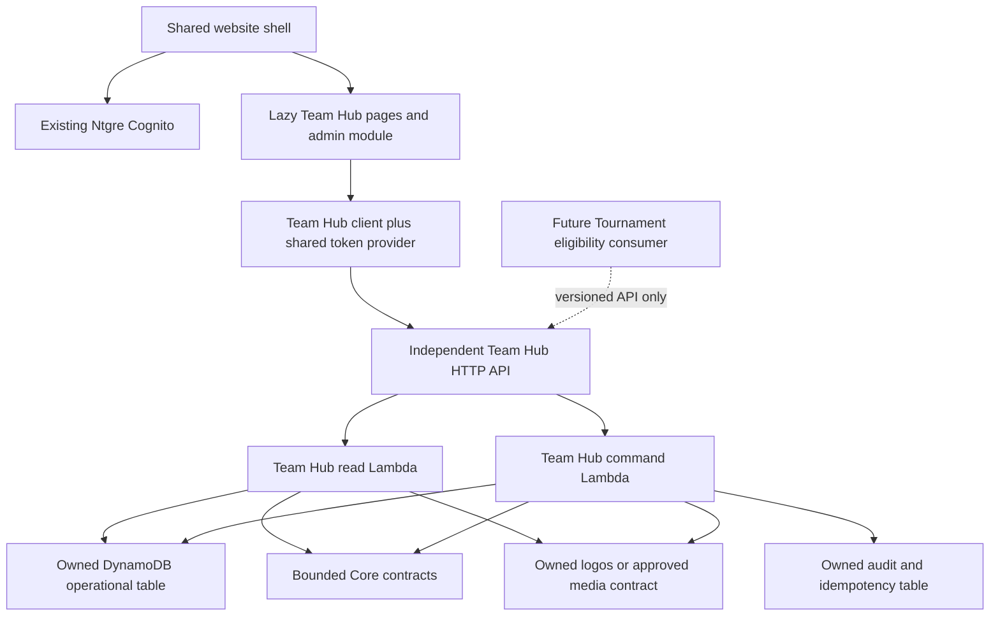

# Project Respawn Phase 2B — Team Hub independent-domain extraction plan

**Status: TEAM HUB EXTRACTION PLAN READY FOR REVIEW. This is not READY_TO_EXTRACT or deployment/migration authorization.** Prepared 4 October 2026 on `phase2/team-hub-extraction`, baseline `96b100072f96d03be13e4bb73f5e9518b76a4ebb`; accepted Tournament checkpoint `98dc1230dfadebbbcc1756823c85c866956ceadc` remains unchanged.

Deliverables: [current dependency map](team-hub-current-dependency-map.md), [target domain model](team-hub-target-domain-model.md), [migration contract](team-hub-migration-contract.md), [source inventory](team-hub-extraction-evidence-2026-10-04/current-source-inventory.json), [live read-only resource inventory](team-hub-extraction-evidence-2026-10-04/current-aws-inventory.json).

## Decision and scope

Team Hub is a coherent independent product: team administration, membership, roster, player champion pools, Coach assessments and team branding/plan settings share authority and transaction boundaries. They justify one independent sibling root, **`ProjectRespawn-TeamHub-Ntgre`**, not one root per page or one generated stack per model. Product owner: Team Hub; a named accountable business/operations owner and Core counterpart still need assignment before execution.

Follow the [domain standard](project-respawn-domain-architecture-standard.md), [classification](project-respawn-domain-classification.md), [checklist](new-domain-checklist.md), [roadmap](domain-migration-roadmap.md), [feature rule](adding-a-new-feature.md), [website audit](full-website-domain-audit-2026-09-30.md) and [Team recovery evidence](team-hub-post-phase1-recovery-2026-09-26.md). This request explicitly authorizes design now; it does not silently complete or waive Tournament's pending Release 2/rollback proof. Resolve that roadmap gate or an explicit sequencing exception before live Team Hub stages.

The accepted Tournament architecture supplies independent app/package/root, same-environment identity, immutable artifacts, endpoint provenance, runtime isolation and practical deployment review patterns. Its stateless fixture handler, eleven-resource budget, particular KMS exception and historical IAM policies are **not** Team Hub's data/security design. Team Hub requires state, live membership authorization, concurrency, recovery and compatibility.

This task creates documentation/inventories only. No refactor, schema change, skeleton, API, policy, manifest, migration tool, live table, frontend cutover, data write, deployment, rollback or production operation was performed.

## Current implementation established from source and AWS

- Seven route records: five lazy user pages, one eager admin page, one redirect. Home and Coach Review mix real persistence with unimplemented/local features; four other pages need fresh connected acceptance. Legacy TeamPool composition code is unrouted and fixture/localStorage-backed.
- Eighteen actions: six reads and twelve mutations behind `readTeamHub` / `mutateTeamHub`. Also shared `getMyAccessContext`, Cognito directory/session calls, S3 logo flows and Data Dragon HTTP dependencies.
- One shared application Lambda, AppSync pipeline/auth/invoke wiring and the full generated Schema/client. Four Team-owned custom-managed tables, two Core permission tables directly, and six Brand/Creator tables indirectly through access-context composition.
- Fresh Ntgre metadata verifies 192 exclusively attributed declarations, FunctionDirectiveStack 167, existing four table identities and shared S3/Cognito owners. Full LegacyPlatform 2,621 remains the accepted historical recursive baseline; this was not a new full-stack drift audit.
- Approximate table metadata counts are zero each; exact consistent data/object counts and authenticated live workflows remain unverified. PITR/deletion protection are disabled; custom table Delete/replace behavior and non-versioned shared media require recovery review.

No automatic extraction readiness follows from passing current tests. The dependency map identifies potential Coach-data response leakage, misleading private-note visibility, revocation races, unversioned writes, inactive-member inconsistency and local-only Coach controls. These must become approved contract decisions and regression cases, not be copied unquestioningly.

## Target topology and alternatives

Selected final architecture: HTTP API, two privilege-separated Lambdas, two native DynamoDB tables, owned private logo storage where justified, CloudWatch logs/metrics/alarms and durable mutation audit. No new Cognito pool, universal business gateway, cross-domain table reads or speculative event bus. Grouping entities within Team's transaction boundary is justified; mixing another product's data to reduce counts is not.

Alternatives considered:

| Alternative | Decision |
|---|---|
| Another Amplify nested stack / `backend.createStack()` | Reject as independence claim: still shares Legacy synthesis/deployment hierarchy |
| Separate Amplify model-per-stack graph | Not preferred: reproduces most resolver/provider overhead without a current subscription/GraphQL composition requirement |
| Native HTTP + owned tables | Preferred compact ownership/control; requires explicit access patterns, authorization, migrations and contract tests |
| Dedicated Lambda that directly uses existing generated tables/client | Only a reviewed temporary compatibility exception; not final data independence, broad full-Schema coupling must not persist |
| CloudFormation import/construct relocation of existing custom tables | Not assumed safe/supported; separately prove provider lifecycle first. Logical copy/transform is the baseline migration design |
| New Core or Admin root holding all Team authority | Reject; Core consumes identity/global grants, Team owns resource decisions and state |

## Frontend and deployment boundaries

Preserve all existing URLs, names, redirects, team slugs and auth behavior. Team routes/pages/admin module load dynamically; global route registration imports only metadata/loaders. Use a lazy domain access adapter, not a global eager Team service. The Team client accepts the accepted endpoint and shared refreshable token-provider callback; it does not repeatedly reconfigure Amplify or initialize another product client. Global `/home` consumes a bounded Team summary; Admin composes a Team module. Clear private state on logout/account switch and revoked access.

Measure static/bundled closure, request/client initialization and cold/cached behavior; five lazy imports alone do not meet the standard. Gate zero unexplained Tournament/Creator/Commerce/Community implementation or client initialization on Team-only navigation, while separately declaring legitimate Core/summary contracts. Current Team code directly imports none of those product implementations, but the shared shell/router/admin entry does. Frontend boundary work must address that entry path before claiming end-to-end isolation.

Proposed source boundaries: `domains/team-hub/`, `infrastructure/domains/team-hub/` with independent CDK app/package/lock/build output, `src/features/team-hub/` or equivalent, owner contracts and domain-scoped tooling. Do not add new files to Tournament's hash-pinned `scripts/domains/` source set merely to reuse names. Use a separate `scripts/team-hub/` or reviewed generalized runner with unchanged Tournament inputs.

An independent Team build/synth/deploy selects only its app/root/assets. Shared contract changes select consumer tests; they do not implicitly deploy all consumers. Do not run `ampx sandbox` or `ampx pipeline-deploy` for an independent Team release. Current hosted pipeline selection is not proven safe; inspect and separately change its actual deploy invocation before connecting a branch. No staging/master/production branch merge or connection change is included here.

## Security design

Deployment and runtime are separate identities with separate policies/boundaries:

| Identity | Required boundary |
|---|---|
| Deployment caller | Only account `058264289478`, region `eu-north-1`, Team root, approved artifacts/change sets and designated CloudFormation service role; no unrelated stack selection or arbitrary PassRole |
| CloudFormation execution | Practical service-level API Gateway lifecycle permissions where resource-level semantics require them; domain-scoped Lambda/IAM/DynamoDB/S3/logging operations where supported. Explicitly record creation/tagging limitations, residual service-level authority and caller/artifact controls. No AdministratorAccess shortcut |
| Read runtime | Lambda-only trust; exact own operational table/index read actions, own log streams, signed reads of own approved logo prefix, explicit Core service calls. No table writes, migration scans, bucket-wide foreign access or identity administration |
| Command runtime | Exact owned table/index actions needed by bounded transactions; journal/idempotency actions; own logo prefix upload/verify/delete, logs and explicit Core contracts. Actor/resource checks enforced in handlers; no generic table name supplied by caller |
| Migration/compatibility identity | Separately reviewed temporary grants, never inherited by normal runtime. Exact source/target and action allowlist; expiry/revocation and audit |

Both runtimes must deny foreign-domain tables/buckets, Tournament, Creator secrets, Commerce data, Cognito Admin/ListUsers, IAM/CloudFormation administration and business KMS keys. Core directory replaces current Cognito lookup. Global group claims alone do not grant membership. Define current role matrix, authoritative base membership/revocation, transactional checks and explicit DTO projection per the target model.

Service-managed Lambda encryption may require a narrowly demonstrated default-key decrypt path; inspect actual service behavior/key before proposing any exception. Do not blindly install Tournament's boundary/ARN or a broad `kms:*` grant. Own-service positives, wrong-team/persona/token negatives, cross-domain/key denies and combined identity/boundary/resource-policy analysis precede runtime acceptance. Simulators are supporting evidence, not a substitute for authorized live checks.

Use API access logs without Authorization headers/payloads, domain application correlation/revision markers, private-data-safe business audits, alarm routing to a named owner and retention controls. Tournament's platform-log-only acceptance exception does not automatically apply to this stateful product. Required alarms include API/Lambda error and latency, throttling, migration lag when applicable and writer-fence violations. First-create permissions, changesets and rollback behavior must be concretely reviewed; rollback stays enabled.

## Resource budget

Current exclusive recursive attribution is **192**, with shared dependencies explicitly excluded. Target numbers below are **design estimates, not synthesized resources or approved additions**. Recount every nested handle, provider, IAM policy, permission, log and generated resource before candidate approval.

| Full MVP product-root component | Estimated declarations |
|---|---:|
| HTTP API, stage, JWT authorizer | 3 |
| Two integrations, 18 explicit routes, two scoped invocation permissions | 22 |
| Two Lambdas, two versions and two aliases | 6 |
| Two runtime roles, two identity policies, one shared domain runtime boundary | 5 |
| Two Lambda log groups and one API access-log group | 3 |
| Five operational alarms | 5 |
| Two DynamoDB tables, GSIs/PITR as table properties | 2 |
| Logo bucket and bucket policy | 2 |
| Alarm topic/subscription and dashboard | 3 |
| CDK metadata allowance | 1 |
| **Estimated product root** | **52** |
| Separate caller/execution roles, policies and boundaries allowance | **6** |
| **Estimated total domain-owned setup** | **58** |

MVP planning envelope: **50–65 product-root declarations; ≤75 including domain security setup**. Stateless/read-adapter stages are smaller and must not precreate data. Mature target: **80–120 total**, with budget review above 120. Flag any root/template **>250** and require explicit architecture review **before 350**, consistent with repository limits. A lower stage-specific limit remains binding even below those global thresholds.

Asset/bootstrap services reused from an existing CDK environment are disclosed shared dependencies, not omitted owned costs. Additional retention versions, backup plans/vaults, custom keys, CDC roles/Lambdas/event sources/queues/alarms, WAF/custom domains or log-delivery policies must be counted when actually chosen. Temporary migration infrastructure and aggregate account cost are separate measured budgets. No speculative infrastructure is preapproved by the range.

This materially smaller proposal does not immediately reduce LegacyPlatform: until authorized retirement, old resources coexist with the new domain and total account resources can increase. Removing shared infrastructure or declaring every attributed resource disposable would manufacture savings.

## Stages and release gates

| Phase | Bounded work | Exit requirement |
|---|---|---|
| **2B1** | Review inventory/ownership/privacy; define schemas and directory/entitlement/delegation contracts; then separately authorized offline independent skeleton | Owner-approved scope, complete persona/contract tests, isolated candidate and accounting; no AWS/data creation |
| **2B2** | Independent authenticated read path with fixtures or approved legacy read adapter, no user cutover | Explicit deployment authorization; read parity and own-runtime security; retained Legacy data dependency disclosed |
| **2B3** | Migration tools, backup/restore and transform/reconciliation rehearsal; dark target only when authorized | Exact source/target/provider map, consistent count/hash/relationship proof, protected recovery, temporary identity and writer-fence plan |
| **2B4** | Independent mutations and atomic membership/revision/idempotency/audit enforcement | All 12 command paths, persona negatives, races/duplicates and rollback-compatible schema tested on synthetic/rehearsal data; user writes still gated |
| **2B5** | Final old-writer fence, delta reconciliation and accepted frontend/compatibility cutover | Single writer verified, accepted manifest, all routes/home/admin consumers, real business/auth acceptance, lazy-loading and unrelated-root stability |
| **2B6** | Observe, prove independent next release and code rollback plus stateful cutover rollback rehearsal | No lost acknowledged writes, measured RPO/RTO, prior artifacts/config restored where applicable, unrelated domains unchanged |
| **2B7** | Review old consumers/provider lifecycle and exact legacy retirement proposal | Separate deletion/retirement authorization after recovery and observation gates; not implied by successful extraction |

The [migration contract](team-hub-migration-contract.md) defines the single-writer order and why a frontend-only rollback is insufficient. Each phase can have a local implementation checkpoint and a separate AWS execution gate. Approving this design does not authorize all seven phases at once.

## Completion criteria

Team Hub extraction is complete at the stated scope only when there is evidence for:

1. Independent sibling root, isolated synthesis/dependency/package/artifact, exclusive deploy selector and hosted release behavior. A Team-only release never synthesizes/deploys LegacyPlatform, Tournament, Creator, Commerce or Community.
2. Existing same-environment Cognito consumed, independent API/client/runtime and validated accepted manifest; no duplicated identity or global configuration repointing.
3. Team-owned data/storage authority established with no normal runtime foreign database access; all temporary bridges/exceptions closed or explicitly reported as incomplete extraction.
4. Existing persisted workflows/deep links/home/admin consumers preserved, with approved corrections for privacy/concurrency; local-only demos are not represented as persisted features.
5. Trusted identity, live resource membership, Admin/Manager/Coach/Player/branding rules, field privacy, revocation/race/negative cases and durable audit proved.
6. Consistent migration counts/hashes/relationships/assets, one writer, tested backups/restore and measured rollback; no unaccounted records or acknowledged writes lost.
7. Lazy major entries and measured absence of unrelated client initialization/API activity; approved projections remain bounded.
8. Independent update and rollback, live business/log/metric/alarm acceptance, no unexpected protected changes, resource budgets met and operational owner/runbooks established.
9. Legacy retirement separately reviewed. If old resources remain retained for the rollback window, state that explicitly; do not claim their deletion or reduced resource baseline.

## Validation performed and remaining decisions

Fresh checks: **47 Team backend tests and 26 frontend/contract/render tests passed**. Read-only AWS inventory verifies four template subtrees, gateway declarations, table recovery settings and shared dependencies. Source hashes anchor the analysis. No authenticated business flow, new synthesis, migration rehearsal or live Team API was executed. Documentation links, JSON structure, accounting arithmetic, source immutability and secret-pattern checks are recorded in the evidence validation file.

Before implementation scope is approved, decide:

1. Named Team/Core owners and Tournament-proof sequencing gate/exception.
2. Coach-only versus Manager-visible assessment fields, inactive-member visibility and handling of local-only controls; fix potential raw Player response disclosure in a separately authorized change.
3. Core directory/entitlement contracts, identity delegation and revocation freshness; whether a temporary read bridge is justified.
4. Exact records/traffic/object inventory, custom-provider safety, backup/restore and RPO/RTO/window; do not treat approximate zero counts as proof.
5. Two-table access-pattern/concurrency benchmark, schema/reverse-transform compatibility and audit retention.
6. Owned-logo bucket versus bounded shared-media API, object recovery and cleanup semantics.
7. Hosted pipeline/domain selection, alarm ownership and complete IAM/lifecycle budget before any live candidate.

**Next step:** review these documents and authorize a bounded **2B1 contracts/offline skeleton** task if accepted. Do not deploy, copy records, create duplicate live tables, remove legacy operations or begin frontend cutover from this report. Tournament API `msipnwy39j`, accepted IAM and AWS resources remain untouched; Release 2/rollback stays pending separately.
