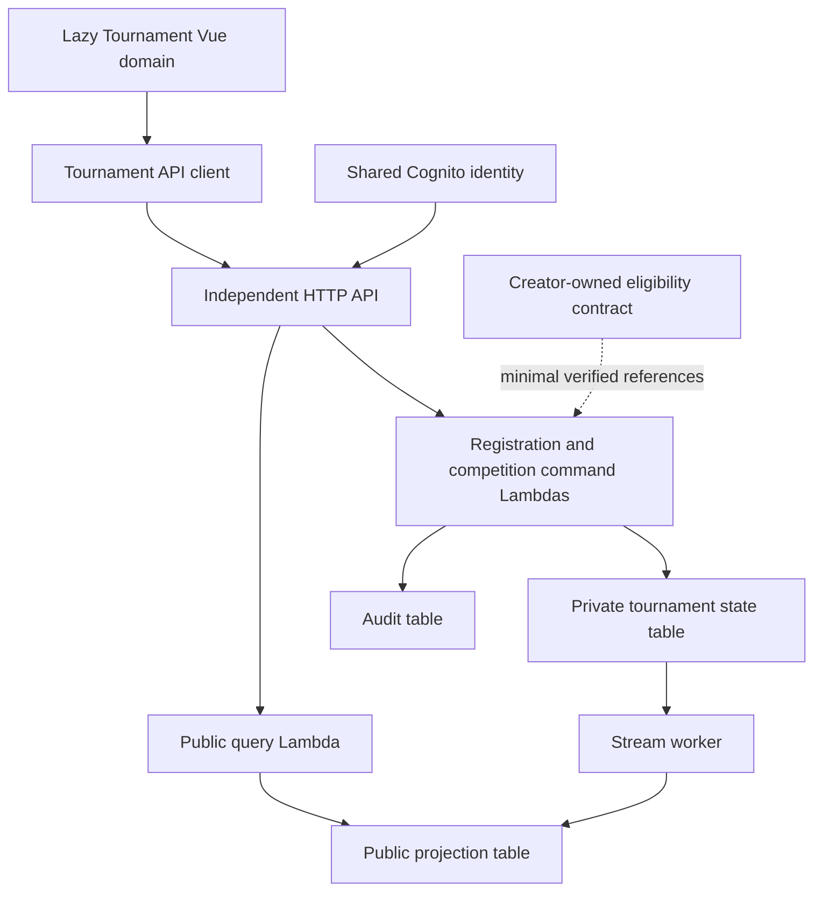

# Founder’s Cup implementation plan

Status: planning proposal, 27 September 2026. No implementation or deployment authorization. Founder’s Cup is the first configuration of a reusable Tournament platform.

Companion specifications: [domain model](tournament-domain-model.md), [API contract](tournament-api-contract.md), [rules configuration](founders-cup-rules-config.md).

## Evidence and current position

This plan follows the [feature architecture checklist](../architecture/adding-a-new-feature.md), [Phase 2 decomposition](../architecture/phase2-domain-decomposition-plan.md), [frontend assessment](../architecture/frontend-modules.md), [final Phase 2A boundary](../architecture/phase2a-tournament-deployment-boundary-final-2026-09-26.md), and [security bootstrap report](../architecture/phase2a-tournament-security-bootstrap-2026-09-27.md). AWS status below is the last recorded evidence, not a fresh live inspection.

| Area inspected | Actual implementation | Product implication |
| --- | --- | --- |
| `src/features/tournaments/tournament.routes.js` | Lazy shell and 13 lazy child routes; fixture lookup in route guard; unknown slug redirects to Founder’s Cup | Preserve deep links, replace fixture guard with API lookup and genuine 404; separate protected registration/lobby/admin |
| `tournament.data.js` in that directory | One demo tournament, six teams, six matches, sample news/streams/champions; November label and preview format | Migrate content into explicit demo fixtures; real records supply dates and rules; never silently fall back to demo data |
| `shell/TournamentShell.*` | Shared navigation and explicit fixture-only preview notice | Keep preview identification until real configured publication |
| `shared/TournamentPageContent.*` and `src/views/Tournaments/` wrappers | Overview, teams, matches, draft, bracket, registration, broadcast and other views share one large conditional component | Reuse visual components; split responsibilities incrementally rather than rewrite all routes |
| Registration and rosters | Local preview toggles; “5 + 2”, Team Hub wording and creator-not-playing assertion | These are not approved eligibility rules. Creator participation, substitutes and Team Hub requirement remain decisions |
| Draft and bracket | Local pick/hover/ready state, sample exclusions and illustrative bracket, including lower-bracket presentation | No authoritative draft engine, game history or bracket progression exists; double elimination is not confirmed |
| Broadcast | Mock controls and sample partner streams | No live provider integration or reliable live-status source exists |
| `tournament.test.mjs` | Six fixture/route/component checks | Retain these while adding meaningful engine, authorization, concurrency and integration coverage later |
| `src/features/esports/` | Separate tournament cards and placeholder detail route | Preserve existing URLs or document redirects; do not mistake placeholder content for a second backend |
| `domains/tournaments/preview/handler.ts`, client and independent stack | Narrow JWT-protected preview contract; 11-resource stateless candidate | Not a registration, competition or public product API |
| Global router and bootstrap | Other feature routes and Team Hub service dependencies are imported globally; some data clients instantiate lazily | Dynamic Tournament routes alone do not prove isolation. Measure loaded modules and actual initialization separately |

No real Tournament models are to be added to LegacyPlatform’s shared Amplify schema. Existing Creator overlay drafts are unrelated to competition drafting.

## Protect the Phase 2A experiment

The last report records the five-resource security bootstrap complete, the Tournament product root absent, and Release 1 → Tournament-only Release 2 → rollback to Release 1 outstanding. LegacyPlatform remained 2,621 resources, largest FunctionDirectiveStack 167, with 62 stack/template identities unchanged.

Preserve these exact proof identifiers:

- Source-manifest revision: `b75a91494c03606d825e234a65d295c184067820cd77dfc84e11a2c83484ae2f` (not a Git commit SHA).
- Product template SHA-256: `b9be81faba86a3a8e1949cca1c802720a7bf557cc74cd6cb7f5ee17423c35705`.
- Target: account `058264289478`, region `eu-north-1`, product root `ProjectRespawn-Tournaments-Ntgre`; protected LegacyPlatform root `amplify-projectrespawnwebsite-Ntgre-sandbox-8bd9d02332`.
- Keep the preserved assembly and original proof worktree untouched. Current HEAD is not a replacement proof input.

The current runtime permissions boundary is logs-only. Stateful product access requires a future reviewed boundary change; it is not already permitted. The bootstrap execution window expires at `2026-09-27T23:59:00Z`; a future proof attempt needs a fresh gate and separately authorized correction if expired. Exact API-ID lockdown and API access logging remain subject to their documented gates. This plan does not extend permissions or expiry.

Branch strategy: retain the original isolated proof worktree/manifest. Create a separate product branch such as `feature/tournaments-founders-cup` from reviewed `development` for later authorized development, with its own worktree and local output directories. Carry these planning documents into it. Do not merge product code into the proof candidate or regenerate proof artifacts. No new/parallel sandbox is part of this strategy. `master` and `staging` have deployment connections; do not use them for planning publication.

Before proof completion, separately authorized work may include offline contracts, pure state-machine tests, fixture UX, accessibility prototypes and estimates in that product worktree. Backend provisioning, IAM expansion, shared-identity integration, real data and independent deployment must wait for signed proof closeout and separate authorization. This task creates only planning documents.

## Ownership and architecture

Root: `ProjectRespawn-Tournaments-<environment>`. Tournament owns competition configuration, registrations, roster snapshots, matches, drafts, brackets, results, broadcasts and editorial content. These are modules within one domain root, not separate roots per feature. Creator Platform owns creator identity/relationships; Team Hub owns its teams; Cognito owns authentication; reward systems own inventories and fulfillment.

Use native HTTP API, four Lambda functions and three DynamoDB tables. Public queries can only read sanitized public projections. Registration/admin commands and competition commands get narrowly scoped private state/audit permissions. A stream worker maintains projections and processes durable outbox records, with failed deliveries captured for replay. No default AppSync, cross-root CloudFormation exports, direct Creator/Commerce database access or generated resources per entity.

Environment contracts supply region, API endpoint, JWT issuer/client IDs, API schema version and domain identity. Validate environment agreement and reject missing/mismatched configuration; do not guess production endpoints or alter `amplify_outputs.json`. Preserve the existing proof `preview.v1` contract unchanged; the product contract is a separate versioned interface.

HTTP handles CRUD and commands. Start with conditional polling: proposal 1–2 seconds for active draft participants, 3–5 for spectators, 10–30 for ordinary match/bracket views; pause inactive tabs, use ETags/backoff and tune against load/cost measurements. Server timestamps determine deadlines. WebSockets are a later opt-in if measured latency/fan-out warrants their connection store, authorization and operating cost. A disconnected UI is not an authority on match state.

No EventBridge bus is needed for the first internal workflow. Add an outbox-to-event contract when another domain actually consumes outcomes. No S3 is needed for metadata or existing approved asset URLs. Private evidence uploads require a separate design for validation, signed access, retention and scanning before adding a bucket. No arbitrary server-side fetching of user-provided URLs.

## Founder’s Cup experience

Canonical route: `/tournaments/:tournamentSlug`; first record: `/tournaments/founders-cup`. Keep nine navigation areas, add individual `/teams/:teamSlug` pages, and retain match/draft deep links. Unknown records return an accessible not-found view.

| Surface | Real product content and behavior |
| --- | --- |
| Overview | Organizer, game, EUW, free entry, tournament phase, configured dates/timezone, registration deadline/state, current objective, approved format/rules, announcements and CTA |
| Teams/team profile | Approved team identity, creator association, consented public roster, captain label, public seed, matches/results; no private eligibility evidence |
| Matches/detail | Scheduled time, status, series score, certified game history, sides, dispute-safe public result labels |
| Bracket | Active bracket version, progression, byes and game-by-game series details; accessible list alternative |
| Drafts/detail | Authorized live action interface, spectator read-only view, picks/bans, chooser/sides, timer freshness, Fearless availability and completed history |
| Respawn broadcast | Approved official channel, current/next coverage, configured talent and click-to-load player |
| Partner streams | Approved streams and match association; verified or explicitly stale/unknown live status |
| News/info | Tournament announcements, results posts, versioned rules, integrity process, support and policies |
| Registration/lobby | Authenticated eligibility, save/submit/review status, approved roster and scoped participant actions |

After the server deadline, show **REGISTRATION CLOSED** even if an old browser or paused configuration remains open. Display “Dates to be confirmed” for null dates, not historical November/December targets. No fake live markers, viewer counts, prize promises or implied publisher endorsement.

External review should expose a polished, clearly labelled draft until publication gates pass: organizer/contact, identity/game/region, dates, eligibility, format, entry process, rosters, rules, dispute process, broadcast permissions, configured platform rewards and review status. Use Project Respawn branding. A configurable publisher-review field is neutral factual metadata, not a partnership badge. Unresolved material rules block opening registration, while an informational announcement can transparently say they are pending.

Include keyboard operation, non-color status cues, meaningful champion text, mobile layouts, reduced motion and restrained screen-reader timer updates. Public content must be usable without signing in. Social preview metadata needs explicit validation because the current Vue SPA does not guarantee crawler-rendered page metadata; assess frontend prerendering separately.

## Authentication, authorization and shared contracts

Use existing Cognito access tokens with issuer, client/audience, token-use and expiry checks appropriate to the configured authorizer. Derive actor identity from verified claims. Tournament stores scoped role grants and checks object ownership on every protected request; a hidden admin button is not enforcement.

Roles: tournament organizer, registrar, referee, broadcast editor, captain/delegate and participant. Grant management requires a separately defined trusted organizer bootstrap path and audit. A creator relationship is verified through a Creator-owned contract, not inferred from a submitted ID or assumed Cognito group. Public reads require no token and never expose private state.

Proposed `CreatorEligibility.v1`: minimal stable creator ID, authenticated subject relationship, registration eligibility, relationship revision, verified/expiry times and approved public name/stream references. This interface is not claimed to exist today. Confirm the owner and transport; recheck at submission and approval. If unavailable, hold for review or use a documented registrar attestation with evidence and expiry, never accept self-assertion. No automatic Creator infrastructure extraction is required.

Team Hub import is optional pending a product decision: use a read contract to snapshot an authorized roster; do not make public Tournament routes import its client or write back to its data. Reward fulfillment is a future owner-approved idempotent outcome contract; Tournament stores promised/approved reward configuration and fulfillment references, not inventory writes. Result corrections require a reviewed reward correction policy.

## Resource budget

Counts are explicit planning estimates, not synthesized templates or deployment approval. Count effective resources across all nested templates, including generated providers, policies and alarms.

| MVP resource class | Count |
| --- | ---: |
| HTTP API, stage, JWT authorizer | 3 |
| Explicit routes: 12 reads and 24 commands | 36 |
| HTTP integrations | 3 |
| API Lambda invoke permissions | 3 |
| Lambdas: public query, registration/admin, competition, stream worker | 4 |
| Runtime roles with inline policies | 4 |
| Lambda log groups | 4 |
| DynamoDB state/public/audit tables | 3 |
| State stream event source mapping | 1 |
| Stream failure SQS queue | 1 |
| Alarms and dashboard | 9 |
| **Itemized product subtotal** | **71** |

The read route for private workspace data uses the registration/admin integration, never the public query role. GSIs, PITR and TTL settings do not imply a CloudFormation resource per logical entity. Separate security-bootstrap resources are currently five; forecast five to eight after reviewed role-specific boundary design. Combined itemized subtotal is therefore 76–79, before contingency. Product MVP envelope: **70–110**; combined envelope **75–118**. Route changes, access logs, encryption keys or helper resources must update this ledger.

Phase 2A remains **11 product + 5 security**. Future Tournament product envelope: **110–180**, plus separately counted security resources; allow roughly 20–30 within that range for justified WebSocket infrastructure. Older architecture documents gave broader 120–250 or 250–400 bands; this scoped proposal narrows the target and does not authorize those upper bounds. Aim below 200, flag any forecast above 250, start architecture escalation at 300, and hold expansion before approaching 350 until reviewed. CI must compare synthesized counts/diffs and reject unreviewed budget growth.

## Operations and stateful evolution

Monitor API errors/latency/throttling, command conflicts, Lambda failures, projection lag, stream failures and DynamoDB throttling. Eight alarms plus a dashboard are the initial allowance. Redact tokens, private roster evidence and request bodies from operational logs. API access-log configuration needs its own security review; do not reintroduce broad Logs resource-policy permissions.

Public projections are eventually consistent: responses include source revision and observation time; command responses carry authoritative versions. On lag show “updating”, not a fictitious successful bracket advance. Workers handle duplicate/out-of-order records using conditional monotonic revisions. Durable outbox records and replay tooling recover failed processing; no reliance on stream retention alone for permanent delivery.

After state is introduced, retain tables on deletion/replacement, enable PITR, document retention and rehearse restore. Use expand/contract schema versions and backwards-compatible readers. Rebuild public projections from authoritative state. Returning to the original stateless proof template is not a valid product rollback after real registrations exist. Never delete/recreate Cognito, repoint local outputs or migrate users as part of this work.

## Implementation sequence and acceptance gates

| Stage | Scope | Required evidence before advancing |
| --- | --- | --- |
| B1 | Native tables, versioned contracts, auth/grants, command transaction envelope, audit/outbox and resource accounting | Phase 2A closeout; separate implementation/deployment gates; cross-environment and cross-team denial tests; retry/conflict/replay tests; least-privilege boundary review; no LegacyPlatform changes |
| B2 | Founder’s Cup draft config, public projections/hub/team pages, rules and publication validation | Unknown-slug handling; UTC deadline boundaries; no fixture fallback; responsive/accessibility checks; unresolved rules visibly pending; cold-route bundle/network evidence |
| B3 | Creator eligibility, applications, reviews, team/roster snapshots, locks and withdrawals | Duplicate player/registration race tests, owner checks, creator-contract failure behavior, reviewed eligibility/consent and deadline policy |
| B4 | Admin stages/seeds, deterministic bracket, scheduling, results/disputes/corrections | Golden bracket fixtures including byes; atomic activation and concurrent advancement tests; downstream correction freeze; full audit review |
| B5 | Configured side choice, draft engine, Fearless history and referee controls | Both side rules; every action-order step; simultaneous picks, expired deadlines, disconnects, pause/resume, remakes and replay; reviewed champion metadata source |
| B6 | Official/partner broadcasts, approved assignments and announcements | Provider allowlist, permissions/consent, embed/privacy checks; stale live status; no Creator token leakage |
| B7 | Measured realtime needs, load/accessibility polish and external review package | Publication checklist, load/cost/resource evidence, restore/replay rehearsal, support runbook and organizer/publisher-policy review |

Admin capabilities are delivered alongside their corresponding stages, not deferred until after player workflows. Test the pure engines offline before AWS integration. Keep useful regression/security tests in source control; generated outputs and local credentials stay ignored. Every deployment remains separately authorized.

## Open decisions and release blockers

Organizer must approve dates/timezone; team cap; stage format and best-of; seeding/ties; whether creator must play; creator eligibility/reverification; substitutes and account requirements; rank/age/residency rules; roster lock/substitutions; withdrawal/no-show/forfeit/remake policies; Fearless scope and ban carryover; timers/timeouts; result evidence and dispute windows; broadcast rights/delay; privacy/retention; contact route; and reward availability/fulfillment. See the [configuration decision ledger](founders-cup-rules-config.md).

Riot dependencies are conditional, not assumed capabilities. Official documentation describes versioned Data Dragon assets, Riot IDs, production-key-gated Riot Sign On, and Tournament API codes/results; these do not constitute remote draft enforcement or automatic verification of a manually entered identity. Custom-match history publication has participant-consent considerations. Register/review the player-facing product and validate branding/asset use through the applicable process. [Riot League developer documentation](https://developer.riotgames.com/docs/lol).

The Europe community competition guidelines are linked by Riot, but that destination could not be retrieved during this review. Current eligibility, permission route and applicable competition terms remain unverified release blockers; no license or approval is claimed. [Europe competition guidelines](https://riot.eurcommunitycompetition.com/games/league-of-legends/guidelines/). Provider embed/status APIs and privacy requirements also need confirmation before integration; the MVP can use approved links and manually maintained schedules without promising live detection.

**FOUNDER’S CUP IMPLEMENTATION PLAN READY FOR REVIEW. DO NOT DEPLOY.**
